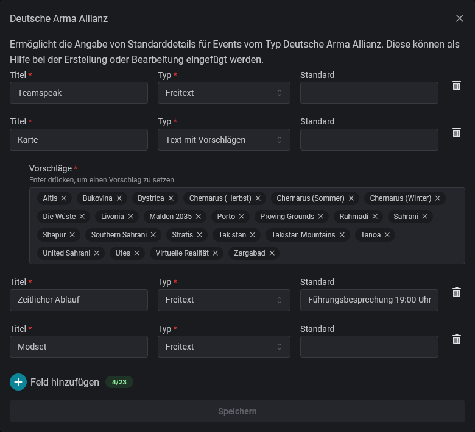

# Event Standards

Event-Detail-Standards sind vergleichbar mit Vorlagen für ein Event. Dadurch wird der Erstellende eines Events an wichtige Informationen erinnert, die er den Teilnehmenden mitteilen sollte.

Bei den Vorschlägen kann es sich um Freitext, Freitext mit Auswahlmöglichkeiten oder eine Ja/Nein-Auswahl handeln. Alle können optional bereits vorausgefüllt werden.

<figure><figcaption></figcaption></figure>

Event-Erstellende können diese Vorlage dann ganz einfach nach Auswahl des Event-Typs in den [#details](../events/eventerstellung/#details "mention") eines Events verwenden.
