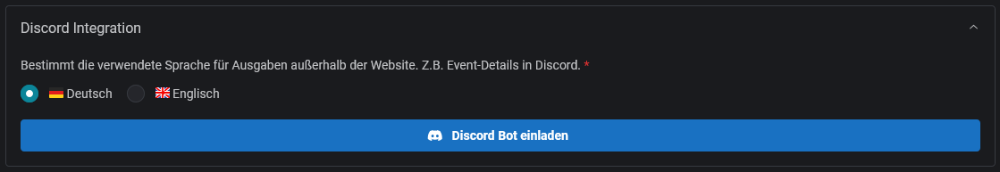
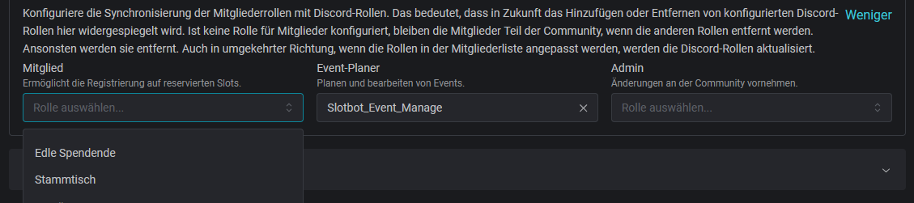

# Konfiguration


B**erechtigungen**

Um eine Community zu konfigurieren, ist die Rolle `Admin` erforderlich.


## Discord Integration

### Sprache

Nicht alle Integrationen erlauben die Anzeige in der vom Benutzer bevorzugten Sprache. Für statische Texte, wie z.B. Event-Details in Discord, kann eine Sprache konfiguriert werden.

<figure><figcaption></figcaption></figure>

Die folgenden Einstellungen können ausschließlich nach Beitritt des Bots auf dem Server vorgenommen werden.

<figure><figcaption></figcaption></figure>

### Archivierungskanal

Nach Abschluss von Events besteht die Möglichkeit, diese in einem Archivkanal zu sammeln.


[archiv.md](../integrationen/discord/archiv.md)


### Synchronisierung der Mitgliederrollen

Die drei Berechtigungsrollen können mit Discord-Rollen verknüpft werden. Wird anschließend einer Person eine neue Rolle zugeordnet, wird diese automatisch mit der entsprechenden Discord-Rolle versehen. Dies funktioniert auch umgekehrt: Wird die verknüpfte Discord-Rolle vergeben, wird die Rolle automatisch angepasst.

<figure><figcaption></figcaption></figure>


Es können nur Rollen unterhalb der Slotbot-Integrationsrolle ausgewählt werden. Die Reihenfolge der Rollen kann in Discord in den Servereinstellungen unter Rollen angepasst werden.



Tipp: Wenn ihr Discord-Rollen konfiguriert, konfiguriert diese auch für die [Slash-Befehle](../integrationen/discord/empfohlene-konfiguration.md).


## Event-Typen

Hier werden alle verfügbaren Event-Typen angezeigt. Die als "Global" markierten Typen sind vorgegebene Standards. Alle anderen sind privat für deine Community.

<figure><figcaption></figcaption></figure>

Für alle Typen können Vorlagen konfiguriert werden. Lerne hier mehr darüber:


[event-standards.md](event-standards.md)

