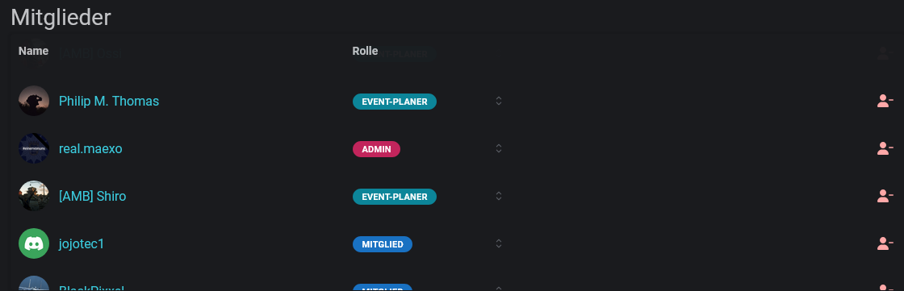

# Mitglieder

Die Spieler sind Teil der Communities. Nur die dort aufgeführten Personen haben die Möglichkeit, sich für die [reservierten Slots](../../events/eventerstellung/teilnahmeplatz-regeln.md#reservierung) anzumelden.

<figure><figcaption></figcaption></figure>


**Berechtigungen**

Zur Verwaltung der Mitglieder ist die Rolle `Admin` erforderlich.


Neue Mitspieler können über die [#synchronisierung-der-mitgliederrollen](../konfiguration.md#synchronisierung-der-mitgliederrollen "mention") oder mit dem [community-hinzufuegen.md](../../integrationen/discord/bot-befehle/community-hinzufuegen.md "mention")-Befehl hinzugefügt werden.
