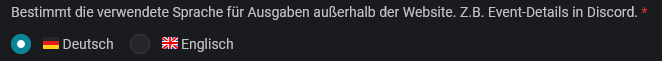
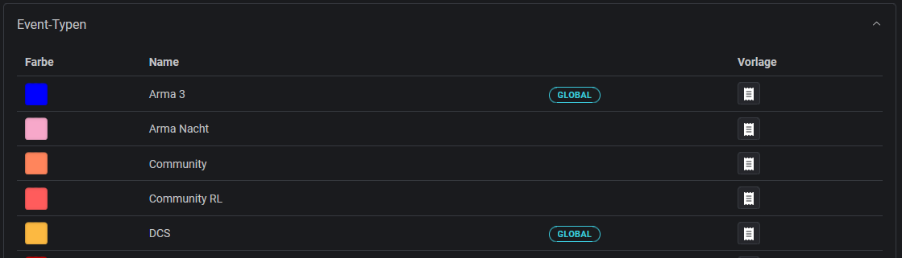

# Communities / Guilds

**Link:** [**https://slotbot.de/guilds**](https://slotbot.de/guilds)

Wir sind davon überzeugt, dass von gemeinsamen Events alle profitieren. Der Slotbot hilft dir, gemeinsam mit anderen zu planen.

Egal, ob jeder teilnehmen kann oder nur einzelne Plätze reserviert werden sollen: Planung und Einladung bleiben einfach.

## Verwaltung

### Sprache

Nicht alle Integrationen erlauben die Anzeige in der vom Benutzer bevorzugten Sprache. Für statische Texte, wie z.B. Event-Details in Discord, kann eine Sprache konfiguriert werden.

<figure><figcaption></figcaption></figure>

### Event-Typen

Hier werden alle verfügbaren Event-Typen angezeigt. Die als "Global" markierten Typen sind vorgegebene Standards. Alle anderen sind privat für deine Community.

<figure><figcaption></figcaption></figure>

### Spieler

Die Spieler sind Teil der Communities. Nur die dort aufgeführten Personen haben die Möglichkeit, sich für die [reservierten Slots](../eventerstellung/eventerstellung/#reservierung) anzumelden.

Um neue Mitspieler hinzuzufügen, wähle [community-hinzufuegen.md](../integrationen/discord/bot-befehle/community-hinzufuegen.md "mention").
