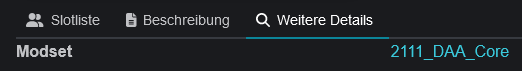

# Besondere Event Details

## Modset

Ein Feld mit dem Namen "Modset" kann automatisch verlinkt werden.  Voraussetzung dafür ist, dass die entsprechende Datei zum Herunterladen auf den Server geladen worden ist.

 

<figure><figcaption>
Verlinkung in Discord
</figcaption></figure>

## Ja/Nein

Boolsche Felder werden automatisch übersetzt und während der Editierung als diese angezeigt.
