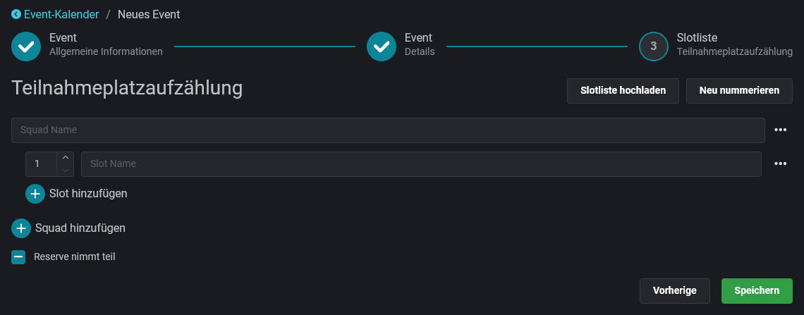

# Wizard

Events werden über die Website angelegt. Nach erfolgreichem Login oberhalb des Kalender "Neues Event anlegen" auswählen und die Eingabemaske öffnet sich.


**Berechtigungen**

Zum Erstellen eines Events ist die Rolle `Slotbot_Event_Manage` oder höher über Discord erforderlich.


## Allgemeine Informationen

<figure><figcaption></figcaption></figure>

### Teilen erlauben

Standardmäßig ist es anderen Gruppen, die den Slotbot benutzen, erlaubt, neue Events zu ihrem Kalender hinzuzufügen und Teilnehmer auf freie, nicht reservierte, Slots einzutragen. Durch Deaktivieren der **Teilbarkeit** kann dieses Event nur im eigenen Kalender und Discord veröffentlicht werden. Ausgenommen davon sind Gruppen, die über Reservierungen eingeladen wurden.

### Versteckt

Durch das **Verstecken** eines Events kann das Event im Kalender nur noch nach Anmeldung von Personen mit der Rolle `Slotbot_Event_Manage` oder höher gesehen werden.

 

### Event-Typ

Der **Event-Typ** kategorisiert Events. Durch die ausgewählte Farbe lassen sich Missionsreihen im Kalender und im Discord auf den ersten Blick erkennen.

<figure><figcaption>
Event-Typ-Farbe im Kalender
</figcaption></figure>

 

<figure><figcaption>
Event-Typ in den Event-Details
</figcaption></figure>

### Beschreibung

Die Beschreibung unterstützt einfache Textformatierungen, wie sie auch aus dem Discord-Chat bekannt sind. Alle unterstützen Formate:


[formatierung.md](../formatierung.md)


## Details

Im zweiten Schritt des Wizards können 23 Freitextfelder definiert werden.

Für einige Event-Typen gibt es definierte Standard-Felder, die dem Event-Erstellenden als Leitfaden dienen können. Siehe dazu [event-standards.md](../event-standards.md "mention").

Event-Details, die in einer speziellen Form angezeigt/formatiert werden, werden in [besondere-event-details.md](../besondere-event-details.md "mention") beschrieben.

## Slotliste

Die Slotliste eines Events besteht immer aus Gruppen ("Squads") und Plätzen innerhalb dieser Gruppen ("Slots"). Die Reihenfolge der Gruppen kann frei bestimmt werden. Die Slots innerhalb eines Squads werden anhand ihrer Slotnummer aufsteigend sortiert.

Wenn alle Slots eines Events belegt sind, wird automatisch eine Reserve in Höhe von 25% der Anzahl der Slots angelegt. Reservisten rücken automatisch in frei werdende Slots nach.

### Reservierung

Über das Drei-Punkte-Menü hinter jeder Zeile können neben dem Duplizieren und Löschen weitere Einstellungen vorgenommen werden. Ganze Squads oder einzelne Slots können für bestimmte Gruppen reserviert werden. Es können sich dann nur noch Mitglieder der ausgewählten Gruppen in diese Slots eintragen. Reservierungen von Squads werden an Slots vererbt.

<figure><figcaption></figcaption></figure>

### Blockierung

Slots können auch blockiert werden. Dadurch werden Anmeldungen für diesen Platz verhindert. Angezeigt wird dies in der Slotliste entweder als "_Gesperrt_" oder den gewählten Ersatztext. Dies eignet sich auch, um die Anmeldungen von Teilnehmenden zu markieren, die keinen Discord Account haben. Siehe dazu auch den Befehl [slot-blockieren.md](../../integrationen/discord/bot-befehle/slot-blockieren.md "mention").

<figure><figcaption></figcaption></figure>
