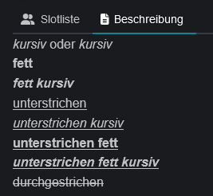

# Formatierung

Die Event Beschreibung unterstützt einfache Textformatierungen, wie sie auch aus dem Discord-Chat bekannt sind. Die Syntax beschreibt Discord in einem [Support Artikel](https://support.discord.com/hc/de/articles/210298617-Markdown-Text-101-Chat-Formatierung-Fett-Kursiv-Unterstrichen-). Die experimentellen neuen Formatierungen (Kopfzeilen, Listen, eingebettete Links) werden noch nicht unterstützt.

<table data-header-hidden data-full-width="true"><thead><tr><th></th><th></th><th></th><th></th></tr></thead><tbody><tr><td><em>Kursivschrift</em></td><td>*kursiv* <strong>oder</strong> _kursiv_</td><td><em>Kursivschrift unterstreichen</em></td><td>__*kursiv unterstreichen*__</td></tr><tr><td><strong>Fett</strong></td><td>**fett**</td><td><strong>Unterstrich fett</strong></td><td>__**unterstrichen fett**__</td></tr><tr><td><em><strong>Fett kursiv</strong></em></td><td>***fett kursiv***</td><td><em><strong>Unterstrich fett kursiv</strong></em></td><td>__***unterstrich fett kursiv***__</td></tr><tr><td>Unterstrichen</td><td>__unterstrichen__</td><td>Durchgestrichen</td><td> ~Durchgestrichen~~</td></tr></tbody></table>

 
