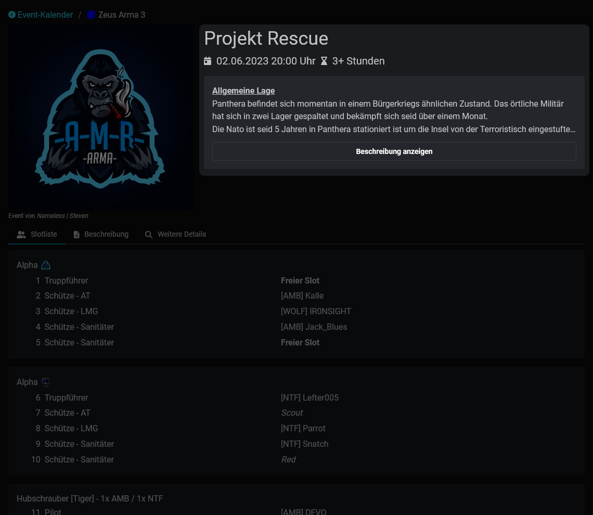
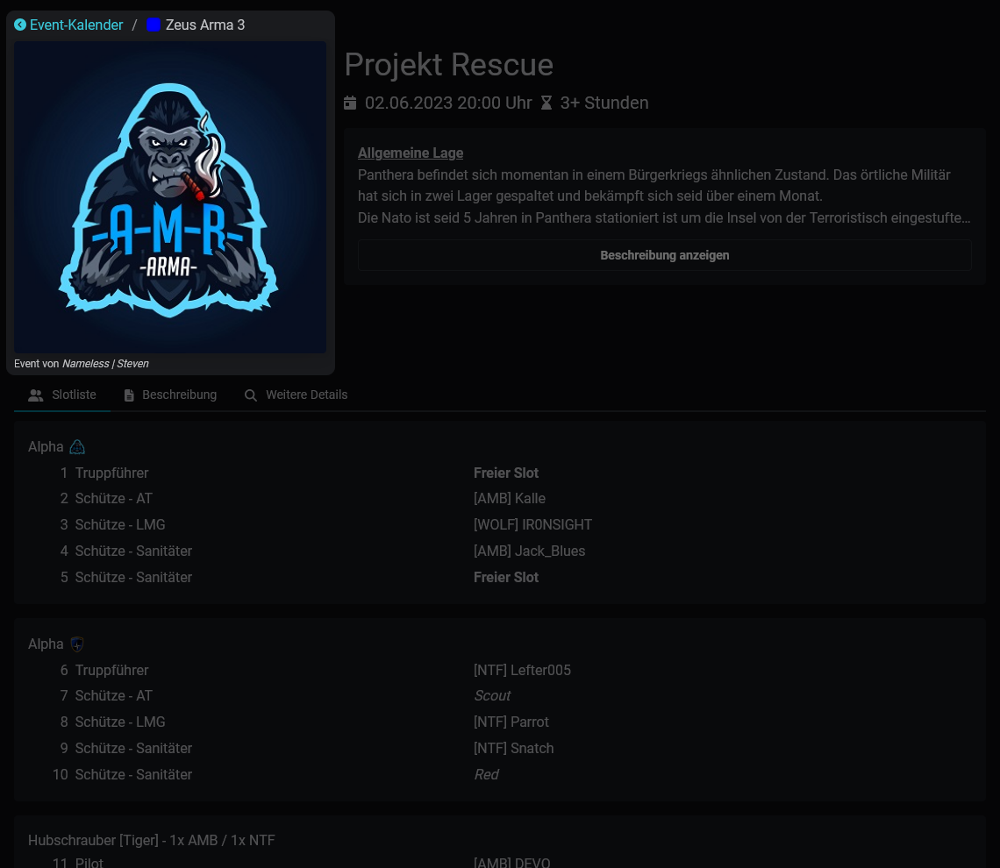
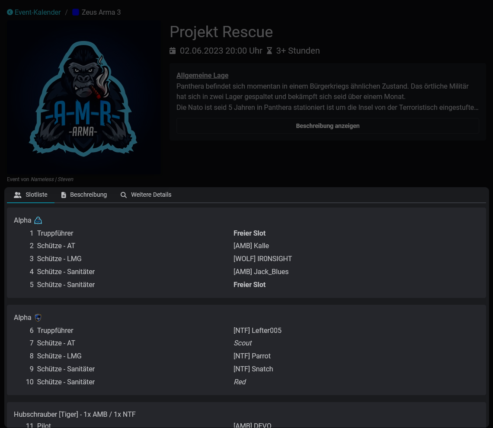
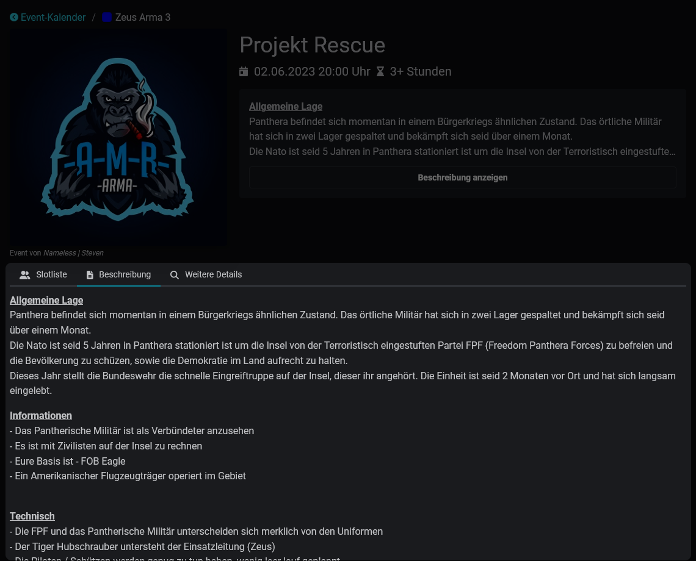
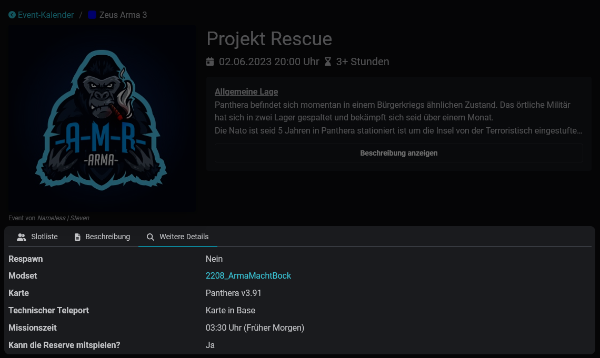

# Event-Details

Die Event-Details enthalten alle wichtigen Informationen zum Event. Lies weiter, um mehr über diese Informationen zu erfahren und wie sie den Teilnehmenden bei der Teilnahme helfen.

## Allgemeine Informationen

<figure><figcaption></figcaption></figure>

Die allgemeinen Informationen enthalten die wichtigsten Rahmendaten: Titel, Zeitpunkt und Dauer des Events. Die [Beschreibung](event-details.md#beschreibung) wird hier ebenfalls kurz angeteasert.

<figure><figcaption></figcaption></figure>

Neben den allgemeinen Informationen finden sich die kategorische Einordnung des Events inklusive der Farbkodierung aus dem [eventkalender.md](eventkalender.md "mention"), ein Titelbild und den Eventersteller.

## Slotliste

<figure><figcaption></figcaption></figure>

Die Slotliste oder Teilnehmendenliste enthält die in Gruppen eingeteilten Plätze. Sie zeigt die Reservierungen und die aktuelle Belegung des Events.

Angemeldete Nutzende können sich in dieser auch direkt an- oder abmelden.

<figure><figcaption></figcaption></figure> <figure><figcaption></figcaption></figure>

## Beschreibung

<figure><figcaption></figcaption></figure>

Die Registerkarte Beschreibung enthält die vollständige Beschreibung des Events.

## Weitere Details

<figure><figcaption></figcaption></figure>

Abschließend bieten die weiteren Details stichwortartige Ergänzungen zur Beschreibung, wie zum Beispiel den Treffpunkt und externe Links.


Schau dir das hier gezeigte Event in der Anwendung an: [https://slotbot.de/events/23169](https://slotbot.de/events/23169)

