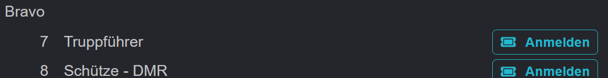

# Event-Details

Die Event-Details enthalten alle wichtigen Informationen zum Event. Vorneweg natürlich die in Gruppen aufgeteilte Teilnehmerliste.

<figure><figcaption></figcaption></figure>

Die Beschreibung enthält Freitext-Informationen, die stichpunktartig durch weitere Details ergänzt werden.

Angemeldete Nutzer können sich in dieser auch direkt An- oder Abmelden.

<figure><figcaption></figcaption></figure>

 

<figure><figcaption></figcaption></figure>

