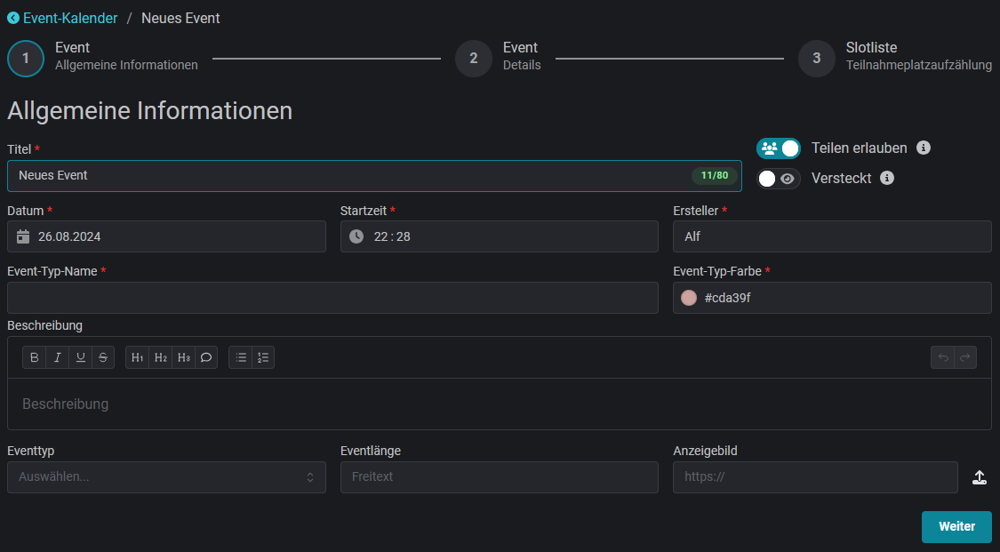

# Events Erstellen

Events werden über die Website angelegt. Nach erfolgreichem Login oberhalb des Kalender "Neues Event anlegen" auswählen und die Eingabemaske öffnet sich.


**Berechtigungen**

Um ein Event zu erstellen, ist die Rolle `Event-Planer` oder höher erforderlich.


## Allgemeine Informationen

<figure><figcaption></figcaption></figure>

Die allgemeinen Informationen für ein neues Event enthalten die wichtigsten Rahmendaten. Dazu zählen unter anderem der Titel, der Zeitpunkt und die Dauer des Events.

### Teilen erlauben

Standardmäßig ist es anderen Gruppen, die den Slotbot benutzen, erlaubt, neue Events zu ihrem Kalender hinzuzufügen und Teilnehmer auf freie, nicht reservierte, Slots einzutragen. Durch Deaktivieren der **Teilbarkeit** kann dieses Event nur im eigenen Kalender und Discord veröffentlicht werden. Ausgenommen davon sind Gruppen, die über Reservierungen eingeladen wurden.

### Versteckt

Ein Event zu verstecken bedeutet, dass das Event im Kalender nur noch für Personen mit der Rolle `Event-Planer` oder höher sichtbar ist.

 

### Event-Typ

Der Event-Typ kategorisiert Events. Durch die ausgewählte Farbe lassen sich Missionsreihen im Kalender und im Discord auf den ersten Blick erkennen.

<figure><figcaption>
Event-Typ-Farbe im Kalender
</figcaption></figure>

 

<figure><figcaption>
Event-Typ in den Event-Details
</figcaption></figure>

### Beschreibung

Die Beschreibung unterstützt einfache Textformatierungen, wie sie aus dem Discord-Chat bekannt sind. Fett, kursiv, unterstrichen, durchgestrichen, drei Ebenen von Überschriften, kleiner Subtext und nummerierte und unnummerierte Listen werden unterstützt.

### Anzeigebild

Für das Anzeigebild kann eine externe URL zu einem Bild angegeben oder ein eigenes Bild hochgeladen werden.

<figure><figcaption></figcaption></figure>

## Details

Im zweiten Schritt des Wizards können 23 Freitextfelder definiert werden. Diese weiteren Details enthalten stichpunktartige Zusatzinformationen zur Beschreibung, wie zum Beispiel den Treffpunkt und externe Links.

Community-Administratoren haben die Möglichkeit, für jeden [Event-Typ einen Standard](../../communities/event-standards.md) für diese Felder festzulegen. Damit bieten sie den Eventerstellenden eine übersichtliche Hilfestellung. Ist ein Standard konfiguriert, kann er über den Button "Standard 'X' Details hinzufügen" verwendet werden.

Event-Details, die in einer speziellen Form angezeigt/formatiert werden, sind in [besondere-event-details.md](besondere-event-details.md "mention") beschrieben.

## Slotliste

Die Slotliste eines Events besteht immer aus Gruppen ("Squads") und Plätzen innerhalb dieser Gruppen ("Slots"). Die Reihenfolge der Gruppen ist frei wählbar. Die Slots innerhalb eines Squads werden aufsteigend nach ihrer Slotnummer sortiert.

Sobald alle Slots eines Events belegt sind, wird automatisch eine Reserve in Höhe von 25% der Anzahl der Slots angelegt. Reservisten rücken automatisch in frei werdende Slots nach.

### Regeln


[teilnahmeplatz-regeln.md](teilnahmeplatz-regeln.md)


### Slotliste hochladen


[arma-3-slotlist-generierung.md](arma-3-slotlist-generierung.md)

