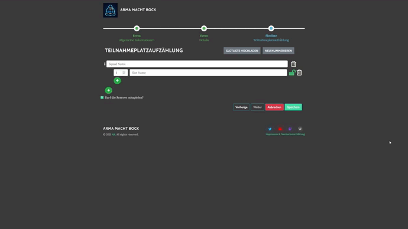

# Arma 3 Slotlist Generierung

Es gibt die Möglichkeit, die in Arma 3 erstellte Slotliste hochzuladen, um automatisiert die Slotliste generieren zu lassen.

Dazu die Mission im Arma 3 Editor speichern und darauf achten, dass "Szenariodatei binarisieren" nicht aktiviert ist. Danach befindet sich die `mission.sqm`, die im Event-Wizard hochgeladen werden soll, im Missions-Ordner. Dieser befindet sich unter `%USERPROFILE%\Documents\Arma 3` -> `missions` oder `mpmissions`.
