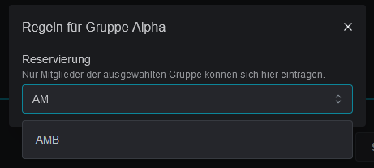

# Teilnahmeplatz Regeln

Über das Drei-Punkte-Menü hinter jeder Zeile können neben dem Duplizieren und Löschen weitere Regeln konfiguriert werden.

<figure><figcaption></figcaption></figure>

### Reservierung

Ganze Squads oder einzelne Slots können für bestimmte Gruppen reserviert werden. Es können sich dann nur noch Mitglieder der ausgewählten Gruppen in diese Slots eintragen. Reservierungen von Squads werden an Slots vererbt.

<figure><figcaption></figcaption></figure>

### Blockierung

Slots können auch blockiert werden. Dadurch werden Anmeldungen für diesen Platz verhindert. Angezeigt wird dies in der Slotliste entweder als "_Gesperrt_" oder den gewählten Ersatztext. Dies eignet sich auch, um die Anmeldungen von Teilnehmenden zu markieren, die keinen Discord Account haben. Siehe dazu auch den Discord-Befehl [slot-blockieren.md](../../integrationen/discord/bot-befehle/slot-blockieren.md "mention").

<figure><figcaption></figcaption></figure>
