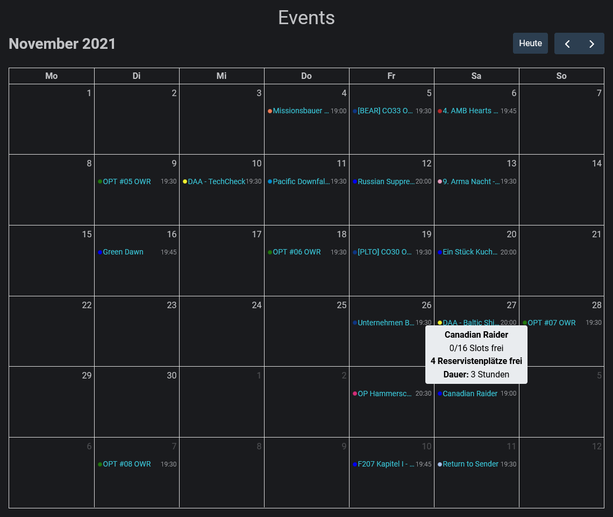

# Eventkalender

Im Mittelpunkt der Planung stehen die Events. Es handelt sich dabei um geplante Veranstaltungen, zu denen sich potentielle Teilnehmer anmelden können.

Der Eventkalender bietet einen kalendarischen Überblick über alle vergangenen und bereits geplanten zukünftigen Events. Farbcodes ermöglichen eine schnelle Unterscheidung der verschiedenen Event-Typen

Durch Klicken auf ein Event öffnen sich die [event-details.md](event-details.md "mention").
