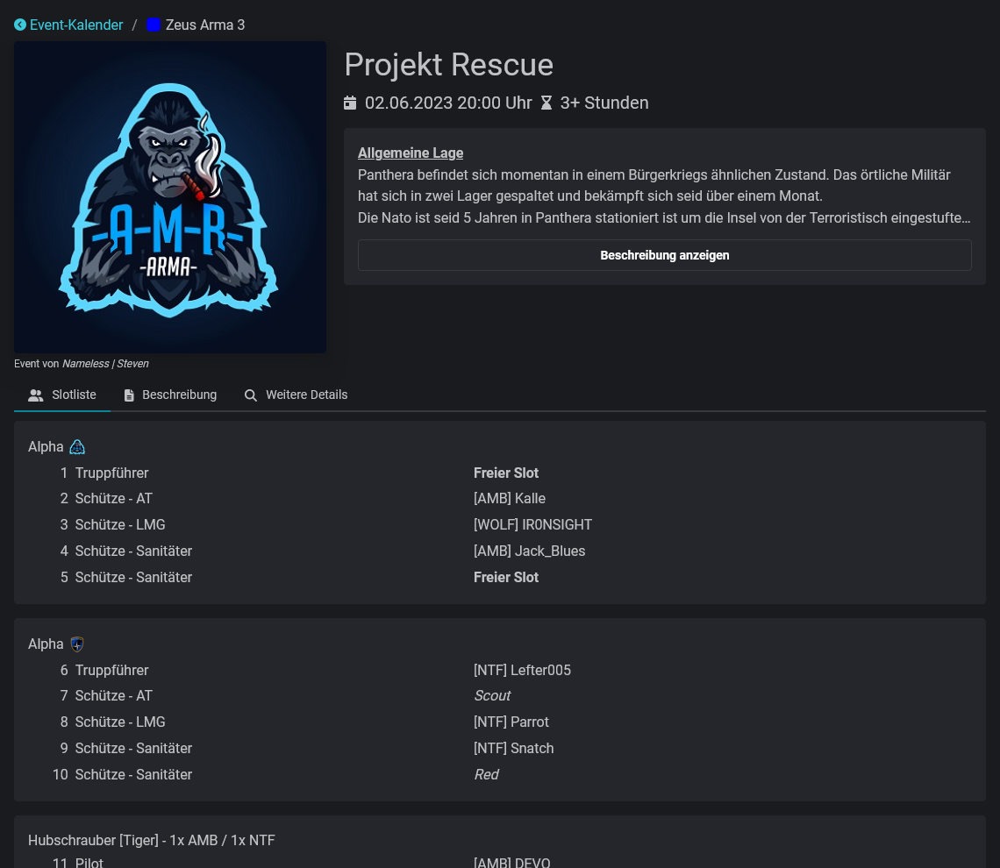

# Übersicht

<figure><figcaption>
Ein Event
</figcaption></figure>

Events sind das zentrale Element des Slotbots. Diese zeitbasierten Veranstaltungen enthalten alle wichtigen Informationen für die Teilnehmenden und zeigen die verfügbaren Plätze an.

<table data-view="cards"><thead><tr><th></th><th></th><th></th><th data-hidden data-card-cover data-type="files"></th><th data-hidden data-card-target data-type="content-ref"></th></tr></thead><tbody><tr><td><strong>Eventkalender</strong></td><td>Die Übersicht über alle geplanten Events.</td><td></td><td><a href="../.gitbook/assets/e2fxodllmjtkt5ixs5tm.png">e2fxodllmjtkt5ixs5tm.png</a></td><td><a href="eventkalender.md">eventkalender.md</a></td></tr><tr><td><strong>Event-Details</strong></td><td>Die Informationen eines Events.</td><td></td><td><a href="../.gitbook/assets/hppmtlj1khkkj38sh63e.png">hppmtlj1khkkj38sh63e.png</a></td><td><a href="event-details.md">event-details.md</a></td></tr><tr><td><strong>Events Erstellen</strong></td><td>In 3 Schritten zur Vorplanung.</td><td></td><td><a href="../.gitbook/assets/slsehtzcrmboceceaxpp.png">slsehtzcrmboceceaxpp.png</a></td><td><a href="eventerstellung/">eventerstellung</a></td></tr></tbody></table>
