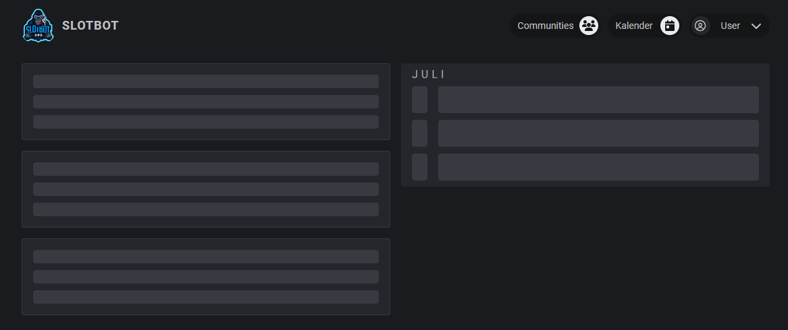

# Update 11.04.2025

<table data-card-size="large" data-view="cards"><thead><tr><th></th><th></th><th data-hidden data-card-target data-type="content-ref"></th></tr></thead><tbody><tr><td><strong>Slotbot-Server</strong></td><td>2.17.0 </td><td><a href="https://github.com/Alf-Melmac/slotbotServer/releases/tag/v2.17.0">https://github.com/Alf-Melmac/slotbotServer/releases/tag/v2.17.0</a></td></tr><tr><td><strong>Slotbot-Frontend</strong></td><td>1.16.0 </td><td><a href="https://github.com/Alf-Melmac/slotbot-frontend/releases/tag/v1.16.0">https://github.com/Alf-Melmac/slotbot-frontend/releases/tag/v1.16.0</a></td></tr></tbody></table>

## ⭐ Neue Features

* Die Eventlänge kann nun mit einem Klick während der Event-Anlage und -Bearbeitung geleert werden. `(Extra für jaco.4)` _(commit:_ [_282de869_](https://github.com/Alf-Melmac/slotbot-frontend/commit/282de8697f70dcbeab6e1ce4be7d3159f083011f)_)_
*   Neue Startseite (erste Ankündigung [update-18.07.2024.md](update-18.07.2024.md "mention")) _(commit:_ [_7c3b844d_](https://github.com/Alf-Melmac/slotbot-frontend/commit/7c3b844d53d8653d6c11cc995f0ee4fafd3ceb2f)_,_ [_ae6f67b0_](https://github.com/Alf-Melmac/slotbotServer/commit/ae6f67b09fee15fc605a5c4d5b7cc126ac57713f)_)_

    <figure><figcaption></figcaption></figure>

    * Für ausgewählte Communities besteht die Möglichkeit, einen Überblick über kürzlich stattgefundene oder bevorstehende Events zu geben. Community-Administratoren können auch Beiträge verfassen, um Informationen in Textform zu teilen.
    * Mehr dazu an späterer Stelle. Interesse die Startseite zu nutzen? Meldet euch bei Alf.
* Neue Event-Archivierungsnachrichten enthalten einen Link zu den Event-Details. _(commit:_ [_5c09ca60_](https://github.com/Alf-Melmac/slotbotServer/commit/5c09ca6000e631dbe15564662ca7c1cd4497bc71)_)_

## 🐞 Fehlerbehebungen

* Bereits bestehende Communities werden beim Einladen des Discord Bots nicht mehr überschrieben. _(commit:_ [_033170e8_](https://github.com/Alf-Melmac/slotbotServer/commit/033170e8a049c909f4cec94fe0b83c82085c0138)_)_

## 🔮 Feature-Vorschau

* Voraussetzungen kann optional ein dunkles Icon konfiguriert werden, das im Light-Theme für besseren Kontrast angezeigt wird. _(commit:_ [_81c15aef_](https://github.com/Alf-Melmac/slotbot-frontend/commit/81c15aefea24491979ea117354db31d081341a73)_,_ [_855acb02_](https://github.com/Alf-Melmac/slotbotServer/commit/855acb02589290b522fe38ff611d649763e8ed87)_)_
* Event-Planer können in den Event-Details sehen, wann Teilnehmer an- und abgemeldet wurden oder untereinander Plätze getauscht haben. Diese Informationen stehen auch für vergangene Events zur Verfügung. _(commit:_ [_f2a4431e_](https://github.com/Alf-Melmac/slotbot-frontend/commit/f2a4431e8fb20aba0ebc67b2120f1c2d7c5f33d8)_,_ [_9cd6f702_](https://github.com/Alf-Melmac/slotbot-frontend/commit/9cd6f7023e5cc9843fd95fab7b2e846c3e7b056f)_,_ [_bb3ed14f_](https://github.com/Alf-Melmac/slotbotServer/commit/bb3ed14f6f9b0b9bfef68762efc854f94232f374)_)_
* Bessere Anzeige und Unterscheidung der Voraussetzungen zu den Reservierung in der Discord-Slotliste. _(commit:_ [_136475ab_](https://github.com/Alf-Melmac/slotbotServer/commit/136475ab075021de6ba31de5aca92496f433b0c4)_)_
* Während des Slottens über Discord werden dem Teilnehmer alle Informationen zu den Voraussetzungen mitgeteilt und die potentiell notwendigen zuweisbaren Voraussetzungen zur Auswahl angeboten. _(commit:_ [_b820a9a6_](https://github.com/Alf-Melmac/slotbotServer/commit/b820a9a6576c52fedc26e7eddf7050ffeccf1f7c)_,_ [_216de5ad_](https://github.com/Alf-Melmac/slotbotServer/commit/216de5adb310954b7526119da8a70633af5465aa)_)_

