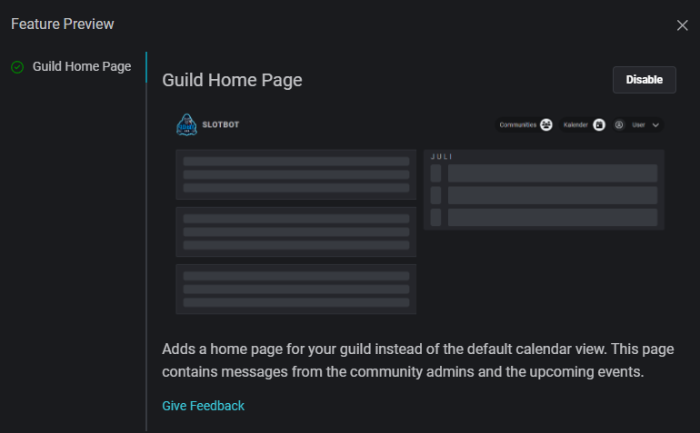

# Update 18.07.2024

<table data-card-size="large" data-view="cards"><thead><tr><th></th><th></th><th data-hidden data-card-target data-type="content-ref"></th></tr></thead><tbody><tr><td><strong>Slotbot-Server</strong></td><td>2.12.0 </td><td><a href="https://github.com/Alf-Melmac/slotbotServer/releases/tag/v2.12.0">https://github.com/Alf-Melmac/slotbotServer/releases/tag/v2.12.0</a></td></tr><tr><td><strong>Slotbot-Frontend</strong></td><td>1.10.0 </td><td><a href="https://github.com/Alf-Melmac/slotbot-frontend/releases/tag/v1.10.0">https://github.com/Alf-Melmac/slotbot-frontend/releases/tag/v1.10.0</a></td></tr></tbody></table>

## ⭐ Neue Features

* Der `/archivieren`-Befehl ist wieder da. Dieser wurde durch die Löschung von Event-Kanäle ersetzt. Jetzt archiviert er nur noch das Event des Kanals und verhindert dadurch die Interaktion oder Aktualisierungen, der Kanal und die Eventausgabe bleiben erhalten. _(commit:_ [_a2825b0d_](https://github.com/Alf-Melmac/slotbotServer/commit/a2825b0db067de3a2c01ed504b58e08233712ae4)_)_
*   Feature-Vorschau: Neue Startseite _(_[_#472_](https://github.com/Alf-Melmac/slotbot-frontend/pull/472)_,_ [_#90_](https://github.com/Alf-Melmac/slotbotServer/pull/90)_)_

    * Eingeloggte Nutzende können über die Feature-Vorschau, die nach dem Login über das Profilbild in der Navigationsleiste erreichbar ist, den Vorabzugriff auf die kommende Startseite aktivieren.

    <figure><figcaption></figcaption></figure>

    * Die Startseite bietet einen Überblick über kürzlich stattgefundene oder bevorstehende Events und Community-Administratoren können bereits Beiträge verfassen, um Informationen zu verbreiten.
    * Um den neuen Einstiegspunkt gut zu gestalten, brauche ich euer Feedback. Wie nützlich ist der Informationsgehalt der Seite? Welche Elemente sollten aufgenommen, welche besser weggelassen werden? Soll es einen schnellen Zugriff auf bestimmte Funktionen geben? [Lasst es mich wissen!](https://discord.gg/HSkgZNhfNK)
