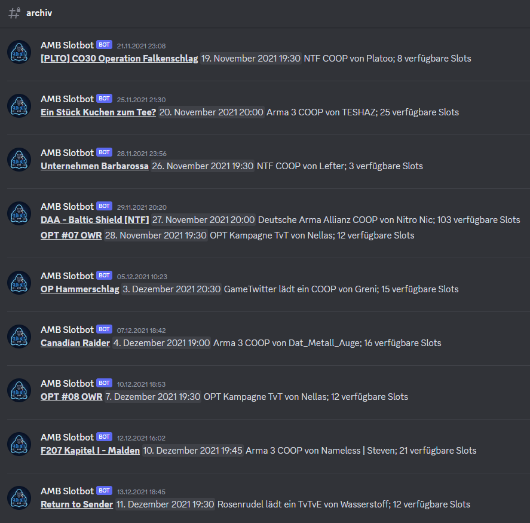

# Archiv

Es erscheint nicht immer sinnvoll, viele Kanäle mit alten Ereignissen und deren Details aufzubewahren. Nichtsdestotrotz kann eine Event-Übersicht neuen Spielern einen nützlichen Überblick geben, um z.B. Spieltage und Event-Größen zu erkennen.

Der Slotbot bietet die Möglichkeit alle vergangenen Events in einem Kanal aufzulisten.

<figure><figcaption></figcaption></figure>

## Einrichtung

Wählen dazu in der Community-Konfiguration einen Archiv-Kanal aus.

<figure><figcaption></figcaption></figure>

Wenn ein Event-Kanal später gelöscht wird, werden die Informationen automatisch in den Archiv-Kanal gepostet.

_Früher gab es für diese Aktion den Befehl `/archivieren`. Dieser ist nicht mehr notwendig, da das Event beim Löschen des Kanals automatisch archiviert wird._

## Archiv neu aufbauen

Sollte das Archiv einmal in einen anderen Kanal verschoben werden oder die Konfiguration erst später vorgenommen werden, kann das gesamte Archiv mit dem [archiv-neu-aufbauen.md](bot-befehle/archiv-neu-aufbauen.md "mention")-Befehl neu erzeugt werden. Je nach Anzahl der vergangenen Events kann dies einige Zeit in Anspruch nehmen.
