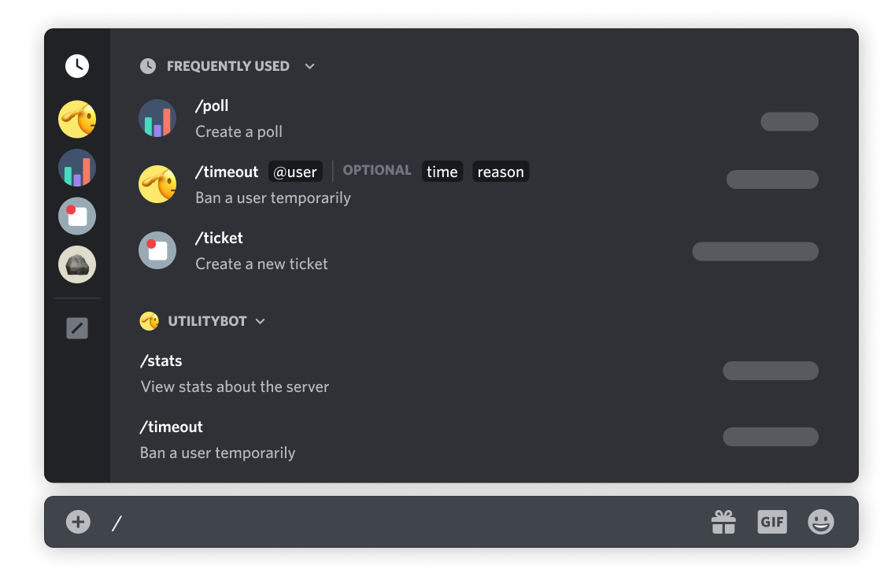

# Bot Befehle

## Slash Command

| Befehl                | Standardmäßig erforderliche Berechtigung | Details                                                    |
| --------------------- | ---------------------------------------- | ---------------------------------------------------------- |
| Archiv\_Neu\_Aufbauen | Administrator                            | [archiv-neu-aufbauen.md](archiv-neu-aufbauen.md "mention") |
| Event\_Hinzufügen     | Kanal verwalten                          | [event-hinzufuegen.md](event-hinzufuegen.md "mention")     |
| Event\_Ping           | Nachrichtenverlauf anzeigen              | [event-ping.md](event-ping.md "mention")                   |
| Slot                  | Nachrichtenverlauf anzeigen              | [slot.md](slot.md "mention")                               |
| Slot\_Blockieren      | Kanal verwalten                          | [slot-blockieren.md](slot-blockieren.md "mention")         |
| Slot\_Entfernen       | Kanal verwalten                          | [slot-blockieren-1.md](slot-blockieren-1.md "mention")     |
| Slot\_Erzwingen       | Kanal verwalten                          | [slot-erzwingen.md](slot-erzwingen.md "mention")           |
| Slot\_Hinzufügen      | Kanal verwalten                          | [slot-hinzufuegen.md](slot-hinzufuegen.md "mention")       |
| Slot\_Umbenennen      | Kanal verwalten                          | [slot-umbenennen.md](slot-umbenennen.md "mention")         |
| Squad\_Umbenennen     | Kanal verwalten                          | [squad-umbenennen.md](squad-umbenennen.md "mention")       |
| Tauschen              | Nachrichtenverlauf anzeigen              | [tauschen.md](tauschen.md "mention")                       |
| Unslot                | Nachrichtenverlauf anzeigen              | [unslot.md](unslot.md "mention")                           |
| Unslot\_Erzwingen     | Kanal verwalten                          | [unslot-erzwingen.md](unslot-erzwingen.md "mention")       |
| Zufälliger\_Slot      | Nachrichtenverlauf anzeigen              | [zufaelliger-slot.md](zufaelliger-slot.md "mention")       |

<figure><figcaption></figcaption></figure>

## Kontext-Menü

| Befehl               | Standardmäßig erforderliche Berechtigung | Details                                                        |
| -------------------- | ---------------------------------------- | -------------------------------------------------------------- |
| Community hinzufügen | Rollen verwalten                         | [community-hinzufuegen.md](community-hinzufuegen.md "mention") |

<figure><figcaption></figcaption></figure>

_Discords_ [_Slash Commands FAQ_](https://support.discord.com/hc/de/articles/1500000368501-Slash-Commands-FAQ) _und_ [_Application Commands_](https://discord.com/developers/docs/interactions/application-commands)
