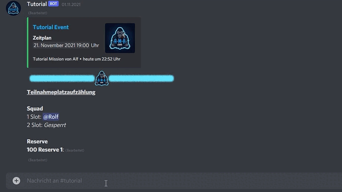

# Unslot erzwingen

## Befehl

/unslot\_erzwingen `slotnummer`

/unslot\_erzwingen\_user `nutzer`

## Aktion

Entfernt die eingetragene Person oder Blockierung von dem Slot mit der angegebenen Nummer. Mit dem alternativen Befehl kann direkt der auszutragende Nutzer angegeben werden.


Suchst du danach, wie durch dich [selbst ausslottest](unslot.md)?

