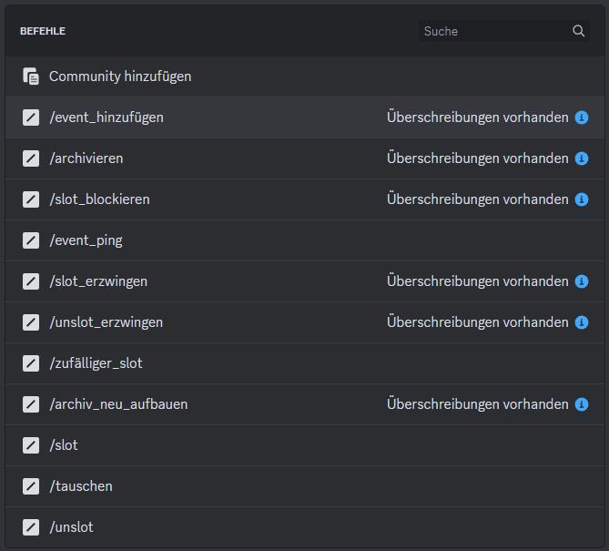

# Empfohlene Konfiguration

## Berechtigungen für Befehle

Um eine möglichst reibungslose Berechtigungskonfiguration zu erreichen, wird empfohlen, die vom Bot angelegten Rollen an den Befehlen zu berechtigen. Natürlich sind hier auch Konfiguration nach Rollen oder Personen möglich. [Erfahre mehr über das Verwalten von Integrationen.](https://support.discord.com/hc/de/articles/360045093012)

<figure><figcaption></figcaption></figure>

<table><thead><tr><th>Befehl</th><th>Überschreibung<select><option value="d9c8a423143a43cd83f335036c944fd5" label="Slotbot_Event_Manage" color="blue"></option><option value="7cbe1a3caed44a18920193d6f08c7ead" label="Slotbot_Admin" color="blue"></option></select></th><th data-type="content-ref">Details</th></tr></thead><tbody><tr><td>Event_Hinzufügen</td><td>Slotbot_Event_Manage</td><td><a href="bot-befehle/event-hinzufuegen.md">event-hinzufuegen.md</a></td></tr><tr><td>Slot_Blockieren</td><td>Slotbot_Event_Manage</td><td><a href="bot-befehle/slot-blockieren.md">slot-blockieren.md</a></td></tr><tr><td>Slot_Erzwingen</td><td>Slotbot_Event_Manage</td><td><a href="bot-befehle/slot-erzwingen.md">slot-erzwingen.md</a></td></tr><tr><td>Unslot_Erzwingen</td><td>Slotbot_Event_Manage</td><td><a href="bot-befehle/unslot-erzwingen.md">unslot-erzwingen.md</a></td></tr><tr><td>Archiv_Neu_Aufbauen</td><td>Slotbot_Admin</td><td><a href="bot-befehle/archiv-neu-aufbauen.md">archiv-neu-aufbauen.md</a></td></tr></tbody></table>
