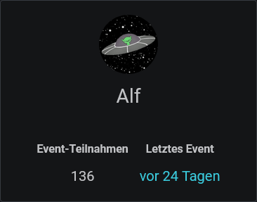

# Profil

Im Profil siehst du verschiedene Dinge, je nachdem, ob du dein eigenes Profil oder das eines anderen Nutzers anschaust.

Deine Gesamtanzahl an Event-Teilnahmen und das Datum deiner letzten Teilnahme sind für alle sichtbar.

<figure><figcaption></figcaption></figure>

Du kannst für dich selbst Discord-Benachrichtigungen konfigurieren und die Integration mit externen Kalendern aktivieren.


[benachrichtigungen.md](../integrationen/discord/benachrichtigungen.md)



[kalender-synchronisation.md](../integrationen/kalender-synchronisation.md)


Du kannst auch deine Steam-ID eingeben. Diese wird derzeit nur für die Kommunikation mit externen Systemen verwendet, aber keine Sorge, da kommt noch mehr, versprochen.
