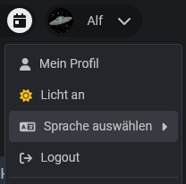

# Sprache

Der Slotbot unterstützt :flag\_de: Deutsch und :flag\_gb: Englisch. Die Sprache wird üblicherweise vom Browser automatisch erkannt, andernfalls kann die Sprache nach dem Login über das Kontextmenü hinter dem Profilbild angepasst werden.

<figure><figcaption></figcaption></figure>
