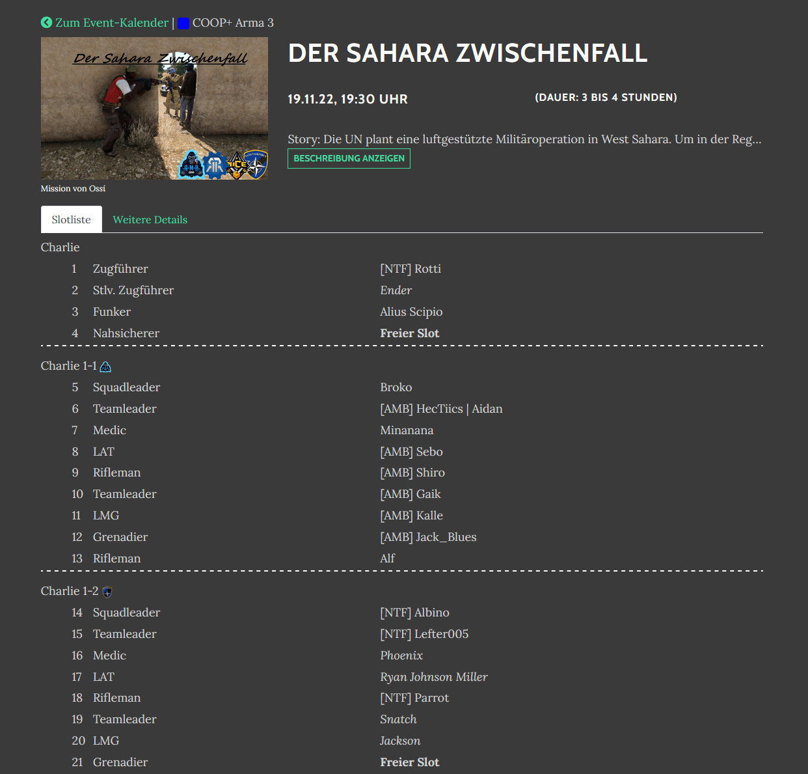
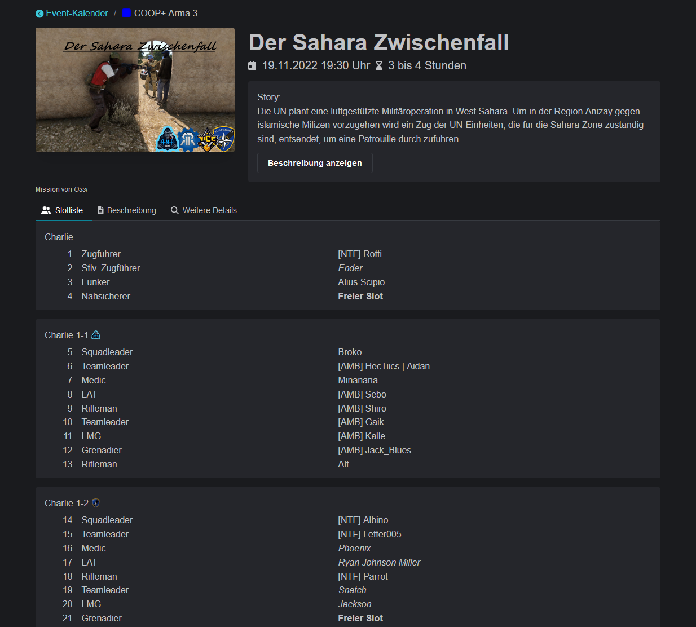
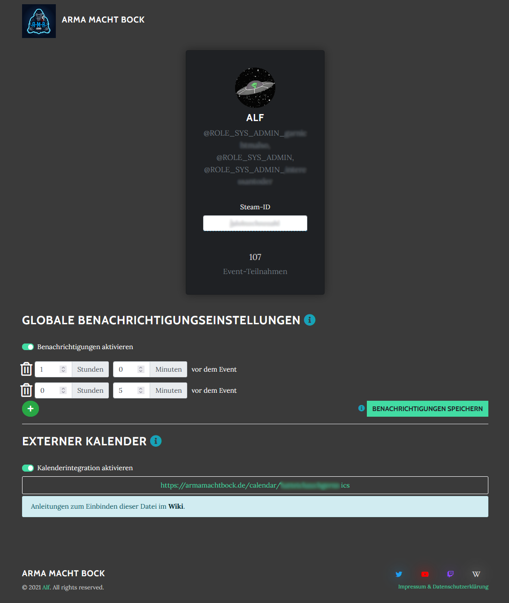
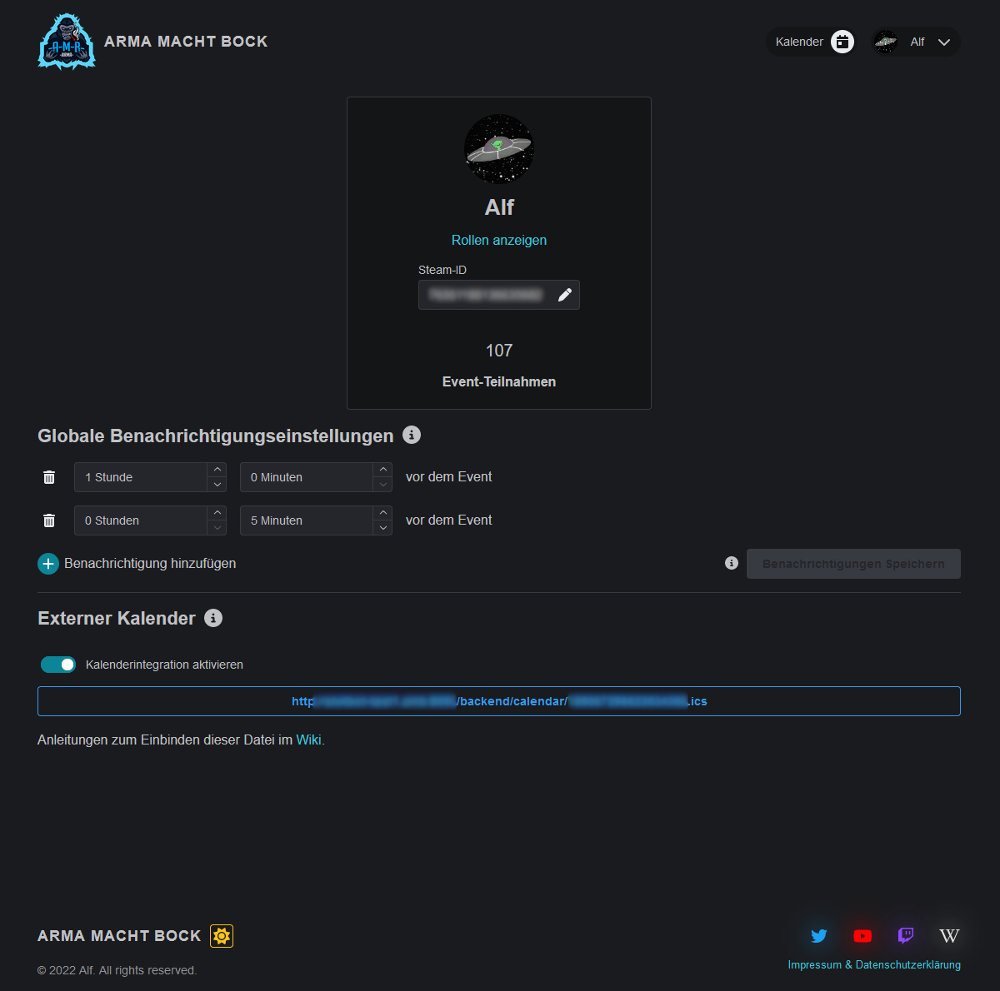

# Update 30.11.2022

## ✨ Neuer, besser, schöner!

Der technologische Umbau ist abgeschlossen. Gleichzeitig mit diesem gibt es nun die neue Oberfläche. Hier ein paar Eindrücke:

<figure><figcaption>
So kennt ihr den Kalender bisher
</figcaption></figure>

 

<figure><figcaption>
In neuem Look
</figcaption></figure>

 

<figure><figcaption>
oder doch lieber in hell?
</figcaption></figure>

<figure><figcaption>
Klick mich, dann werde ich größer
</figcaption></figure>

 

<figure><figcaption>
Ich sehe mehr von der Beschreibung und kann die Gruppen besser auseinander halten!
</figcaption></figure>

<figure><figcaption></figcaption></figure>

 

<figure><figcaption>
Nur noch die für mich relevanten Informationen mit mehr Platz für Benachrichtigungen. Ich vergesse sonst die Events :(
</figcaption></figure>

Statistiken sind toll. Daher erwähne ich hier aus dem Backend Projekt mit dem alten Frontend die [213 changed files](https://github.com/Alf-Melmac/slotbotServer/compare/b3d841982d4f0a5e8f53c42349521ede447848f4...89ffd5693ded34eac2611cd7bb96c3362d9fb7ef) with **1,876 additions** and **9,496 deletions** in **104 Commits**. Und im neuen Frontend-Projekt [160 changed files](https://github.com/Alf-Melmac/slotbot-frontend/compare/4139362f8e435e77b2588800348d0517a4afe735...ac25ba88a8fa835841590dfe2ab524fa9dbcbb8a) with **8,298 additions** and **26,727 deletions** in **313 Commits** nach dem initalen Setup.

## ⭐ Neue Features

* Falls der Nutzer schon ein mal angemeldet war wird er bei erneutem Login von Discord nicht erneut um Bestätigung gebeten, sondern wird direkt eingeloggt. _(commit:_ [_463785aa_](https://github.com/Alf-Melmac/slotbotServer/commit/463785aa457cf80d2408a6fb5f49d59332c2c5fd)_)_
* Reservierungen werden in der Discord-Slotliste angezeigt. _(commit:_ [_72cc227f_](https://github.com/Alf-Melmac/slotbotServer/commit/72cc227fe30b0d987bb73259556b14909d2c553c)_)_
* Die Auswahl der Gruppen für Reservierungen ist nun alphabetisch sortiert. _(commit:_ [_4d1bc65a_](https://github.com/Alf-Melmac/slotbotServer/commit/4d1bc65a1e58a817f29f1bd9c5ae95aeadf9481e)_)_
* Login ist nun auf jeder Seite möglich und leitet auch wieder auf diese zurück. Außerdem ist der Login-Status inklusiver neuer Schnellnavigation jederzeit über die Anzeige oben rechts sichtbar.
* Die Systemadministrator-Rolle muss nicht länger über Discord konfiguriert werden. Dadurch fällt die Rolle auf dem Server weg. _(commit:_ [_b0bf6c68_](https://github.com/Alf-Melmac/slotbotServer/commit/b0bf6c682bf198a474002f39a57572627e9e68f6)_)_
* Erhöhte Sicherheit durch bessere Überprüfungen
  * Schnellere und verbesserte Berechtigungsprüfung. Wenn etwas nicht erlaubtes versucht wird merkst du das nun schneller. Machs trotzdem nicht.
  * Anfragen werden auschließlich von bestätigten URLs und Browsern akzeptiert.
* Die Autovervollständigung der Arma 3 Modsets und Auswahl der Karten wurde auf das [August 2022 Modset von AMB](https://wiki.armamachtbock.de/de/Spieler/Mitmachen/Modset) aktualisiert. Karten bleiben nun auch Freitextfelder. _(commit:_ [_409e7a6c_](https://github.com/Alf-Melmac/slotbotServer/commit/409e7a6c02f05ce38e176669ce962df37441ba42)_)_
* Der `mission.sqm` Upload ist nicht mehr in der Beta-Phase. Sollten unerwarteter Weise dennoch falsch generierten Slots auftauchen sendet Alf gerne die Datei und das erwartete Ergebnis. Der Upload-Mechanismus wird direkt beim Upload ausführlicher erklärt.
* Wesentliche Verbesserungen der Bedienbarkeit
  * Der Klick auf das eigene Profilbild ist besser ersichtlich. Dort findet sich nun auch ein Logout.
  * Was machen die Personengruppe und das Auge in der Eventerstellung und -bearbeitung und welchen Status haben sie eigentlich? Jetzt wird es erklärt.
  * Zu lange oder ungültige Felder werden noch vor dem Speichern während der Eingabe validiert. So kommt nicht mehr die Frage auf, ob noch genug Zeichen für alle Informationen zur Verfügung stehen.
  * Das Event-Datum muss nicht mehr im YYYY-MM-DD Format getippt werden.
  * Hilfestellungen zu den Event-Details, zum Beispiel Autovervollständigung der Karten und Modsets, werden nun auch ohne Verwendung aller Details angeboten.
  * Das Einfügen von Standard-Details überschreibt nicht mehr existierende Details.
  * Vererbungen von Reservierungen werden in der Reservierungsansicht von Slots angezeigt.
  * Events in der Vergangenheit können ohne Anpassung des Datums editiert werden.
  * Die fehlende Speicherung von Details oder der Slotliste beim Bearbeiten eines Events ist nun deutlich ersichtlich.
  * Während der Event-Bearbeitung ist auf einen Blick ersichtlich welche Felder welche Art der Speicherung verwenden.
  * Die meisten Seiten sind mobil wesentlich besser bedienbar.
  * Die Unterstützung für Assistenzsystem, im speziellen Screen Reader, wurde stark ausgebaut.
  * Alle Daten aktualisieren sich live. Bleibt der Tab mit den Eventdetails im Hintergrund siehst du beim zurück kommen ohne neuladen die aktuellen Daten.

Und viel mehr was zu ausführlich wäre hier aufzulisten.

## 🐞 Fehlerbehebungen

* Unter seltenen Umständen konnte bei großen Events die Slotliste nicht in Discord ausgegeben oder aktualisiert werden. _(commit:_ [_0fb501ab_](https://github.com/Alf-Melmac/slotbotServer/commit/0fb501abd7d67431f0126b2cf4aa6571a17c6e04)_)_

## :inbox\_tray: Sonstige Details

* Event-Typen können nicht mehr mit dem gleichen Namen mit verschiedenen Farben existieren.
  * Daher kann während der Editierung eines Events kein neuer Event-Typ angelegt werden.
* ~~Umsortieren von Details und Squads in Events ist über die neue Oberfläche noch nicht möglich.~~ -> [update-31.03.2023.md](update-31.03.2023.md "mention")
* In der Administration ist die feste Status-Anzeige zu den AMB-Events entfallen. Außerdem ist das Slot-Log nicht mehr erreichbar.
* Die Startseite entfällt und wurde in ein [eigenes Projekt](https://github.com/AMB-Coding/amb-landingpage) ausgelagert.
* Alle Seiten haben ein neues Look & Feel bekommen. Ja, sogar die Fehlerseiten.


Die ersten beiden Features und die Fehlerbehebungen wurden zusammen mit einer Sicherheitskorrektur bereits vor und am 31.03. installiert.

