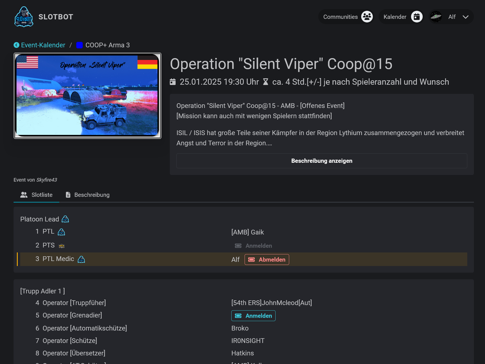
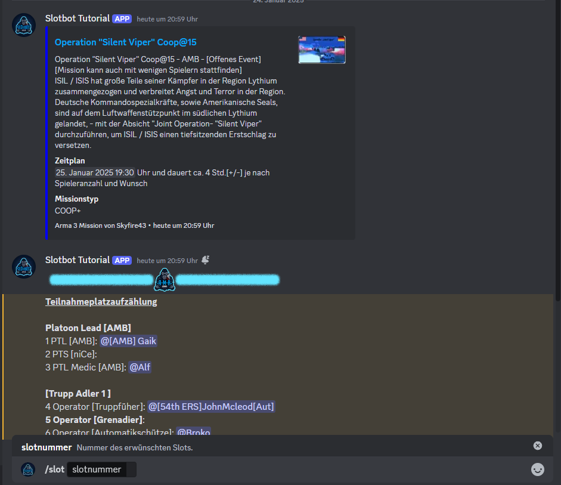

# Warum den Slotbot nutzen?

Egal, ob du für die eigene kleine Gruppe in spontanen Treffen oder groß geplante Abende mit vielen verschiedenen Communities zusammen planst - die Planung bleibt einfach und alle bleiben auf dem selben Stand!

<figure><figcaption>
Ein Event aus dem eigenen Event-Kalender
</figcaption></figure>

Es wird keine manuell versendeten PDFs oder geteilten Excel-Listen mehr geben. Alle Informationen sind für jeden überall abrufbar.

<figure><figcaption>
Als Teilnehmer über Discord anmelden
</figcaption></figure>

&#x20;All das direkt in die eigenen Discord-Server gespiegelt. Und das Ein- und Austragen funktioniert ganz einfach über Textbefehle, ohne dass man die App verlassen muss.


[jetzt-starten.md](jetzt-starten.md)


oder in den Kalender der anderen Communities schauen: [slotbot.de](https://slotbot.de)
