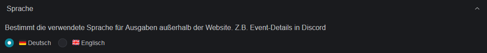
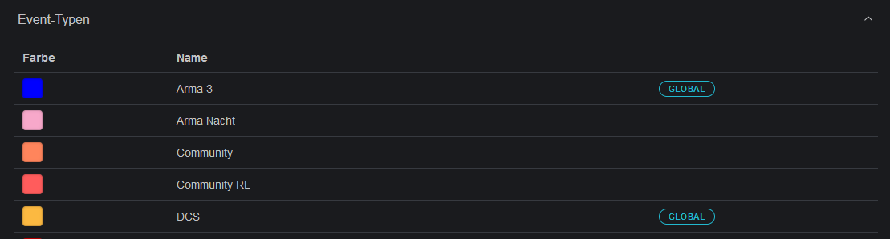

# Communities / Guilds

**Link:** [**https://slotbot.de/guilds**](https://slotbot.de/guilds)

We are convinced that everyone benefits from joint events. The Slotbot helps you to plan together.

Egal, ob jeder teilnehmen kann oder nur einzelne Plätze reserviert werden sollen: Planung und Einladung bleiben einfach.

Whether everyone can attend or only individual places are to be reserved: Planning and invitations remain simple.

## Management

### Language

Not all integrations allow the user to choose their preferred language. For static text, such as the details of an event in Discord, a language can be set.

<figure><figcaption></figcaption></figure>

### Event types

All available event types are listed here. The types marked as "Global" are pre-defined standards. All others are private to your community.

<figure><figcaption></figcaption></figure>

### Members

Members are the integral part of the communities. Only the people listed there have the possibility to register for [reserved slots](../event-creation/eventerstellung/#reservation).

To add new players, select [community-hinzufuegen.md](../integrations/discord/bot-befehle/community-hinzufuegen.md "mention").
