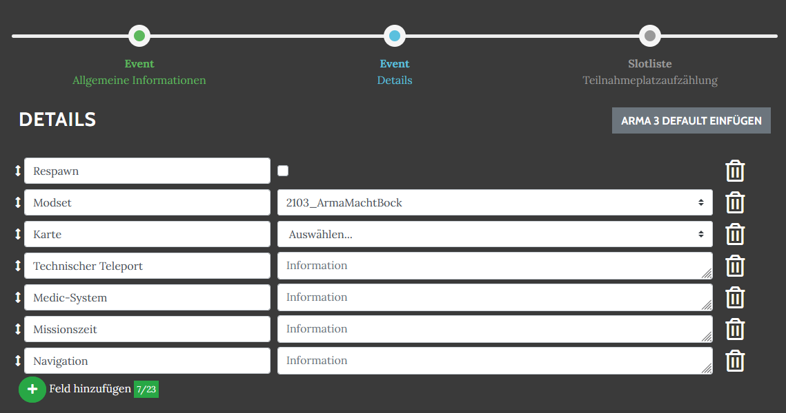
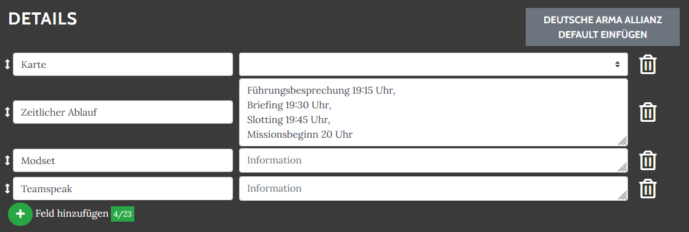
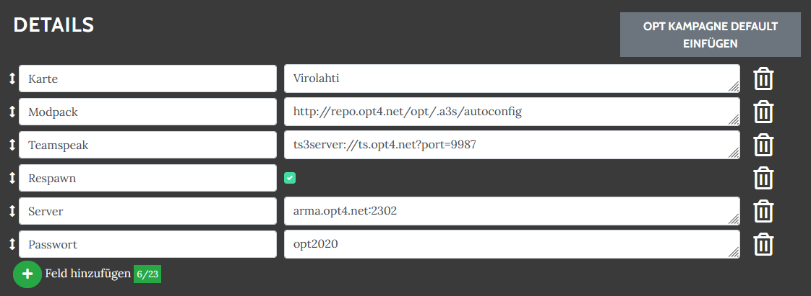

# Event Standards

Event detail standards are comparable to templates for an event. The button "Add standard X datails" can be used to make suggestions for the event details for the event types shown below. This reminds the event creator of important information to share with the participants.

Suggestions can be free text, free text with choices or a yes/no choice. All can optionally be pre-filled.

## Arma 3

## Deutsche Arma Allianz

## OPT Kampagne

