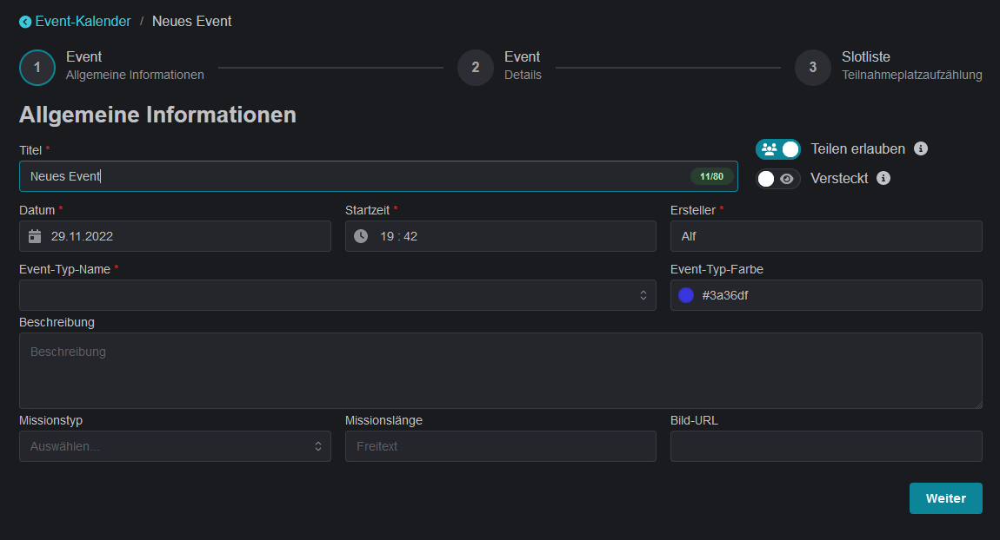
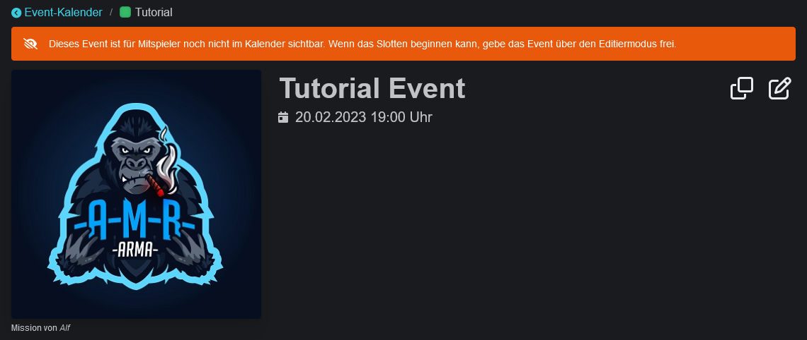
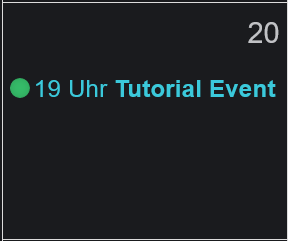
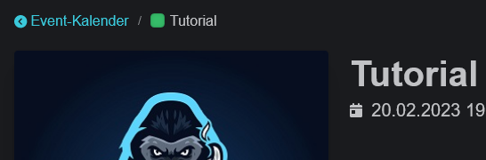
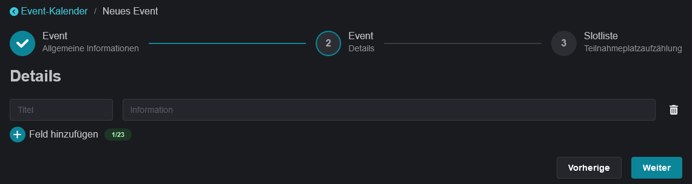
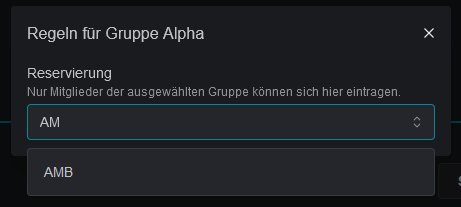
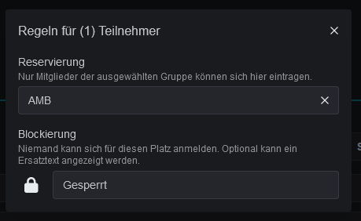

# Wizard

Events are created via the website. Once you have successfully logged in, select "Create New Event" above the calendar to open the event creation wizard.


**Permissions**

To create an event, the role `Slotbot_Event_Manage` or higher is required on Discord.


## General information

<figure><figcaption></figcaption></figure>

### Allow Sharing

By default, other groups using the slotbot will be able to add new events to their calendar and enter participants into empty, unreserved slots. By disabling shareability, this event can only be published in your own calendar and Discord. Groups invited via reservations are excluded from this.

### Hidden

By hiding an event, the event can only be viewed in the calendar by people with the `Slotbot_Event_Manage` role or higher, after they have logged in.

 

### Event type

The event type categorises events. The chosen colour makes it easy to identify mission series in the calendar and in Discord.

<figure><figcaption>
Event type colour in calendar
</figcaption></figure>

 

<figure><figcaption>
Event type in the event details
</figcaption></figure>

### Description

The description supports basic text formatting, similar to Discord chat. All supported formats:


[formatting.md](../formatting.md)


## Details

The second step of the wizard allows you to define 23 free text fields.

For some event types there are defined default fields that can serve as a guide for the event creator. See [event-standards.md](../event-standards.md "mention") as a reference.

Event details that are displayed/formatted in a special form are described in [special-event-details.md](../special-event-details.md "mention").

## Slotlist

The slot list of an event always consists of groups ("squads") and seats within those groups ("slots"). The order of the groups can be freely determined. Slots within a squad are sorted in ascending order by their slot number.

If all slots in an event are occupied, a reserve of 25% of the number of slots is automatically created. Reservists will automatically move into slots that become available.

### Reservation

The three-dot menu behind each line can be used to make further settings in addition to duplicating and deleting. Entire squads or individual slots can be reserved for specific groups. Only members of the selected groups will be able to register in these slots. Slots inherit squad reservations.

<figure><figcaption></figcaption></figure>

### Lock

Slots may also be blocked. This prevents registrations for that slot. It will be displayed in the slot list as either "_Gesperrt_" or the selected replacement text.\
This can also be used to mark registrations from people who do not have a Discord account. See also the command [slot-blockieren.md](../../integrations/discord/bot-befehle/slot-blockieren.md "mention").

<figure><figcaption></figcaption></figure>
