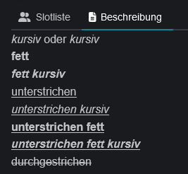
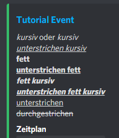

# Formatting

The event description supports simple text formatting, as known from Discord chat. Discord describes the syntax in a [support article](https://support.discord.com/hc/en-us/articles/210298617-Markdown-Text-101-Chat-Formatting-Bold-Italic-Underline-). The new experimental formatting (headers, lists, masked links) is not yet supported.

<table data-header-hidden data-full-width="true"><thead><tr><th></th><th></th><th></th><th></th></tr></thead><tbody><tr><td><em>Italics</em></td><td>*italics* <strong>or</strong> _italics_</td><td><em>Underline italics</em></td><td>__*underline italics*__</td></tr><tr><td><strong>Bold</strong></td><td>**bold**</td><td><strong>Underline bold</strong></td><td>__**underline bold**__</td></tr><tr><td><em><strong>Bold Italics</strong></em></td><td>***bold italics***</td><td><em><strong>underline bold italics</strong></em></td><td>__***underline bold italics***__</td></tr><tr><td>Underline</td><td>__underline__</td><td><del>Strikethrough</del></td><td> ~~Striketrough~~</td></tr></tbody></table>

 
