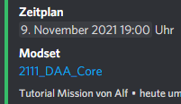

# Special event details

## Modset

A field called "Modset" can be automatically linked.  This requires that the corresponding file has been uploaded for downloading.

 

<figure><figcaption>
Link in Discord
</figcaption></figure>

## Yes/No

Boolean fields are automatically translated and displayed as such during editing.
