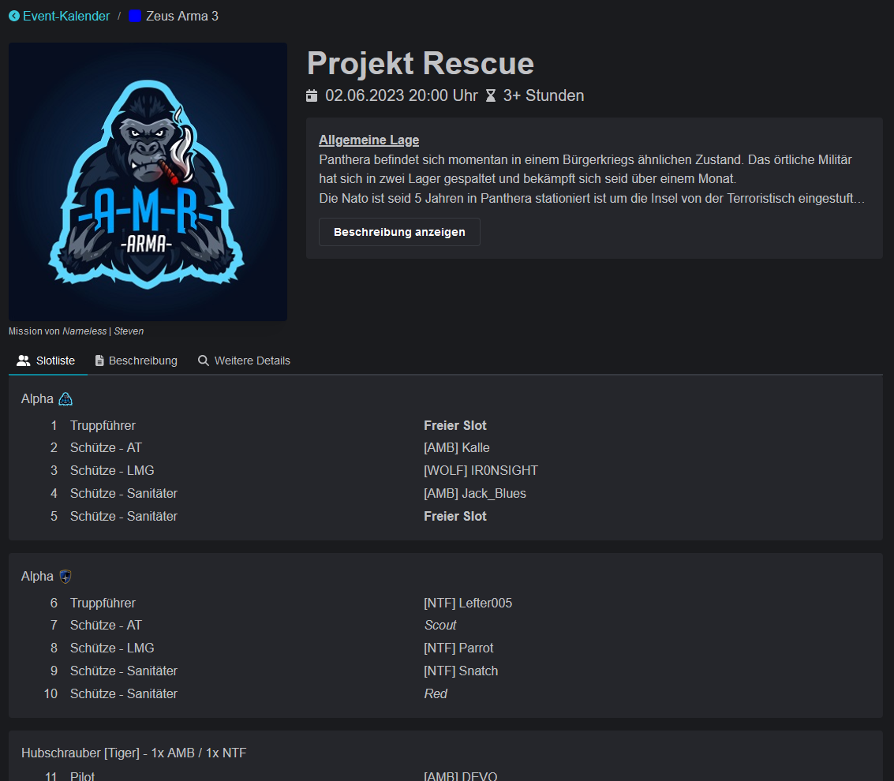
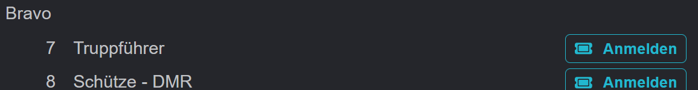
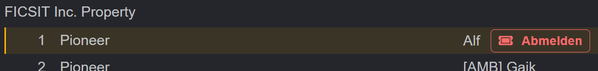

# Event details

Die Event-Details enthalten alle wichtigen Informationen zum Event. Vorneweg natürlich die in Gruppen aufgeteilte Teilnehmerliste.

The event details contain all important information about the event. First of all, of course, the list of attendees, divided into groups.

<figure><figcaption></figcaption></figure>

The description contains free text information, which is supplemented by further bulleted details.

Logged in users can also register or unregister directly from this view.

<figure><figcaption></figcaption></figure>

 

<figure><figcaption></figcaption></figure>

