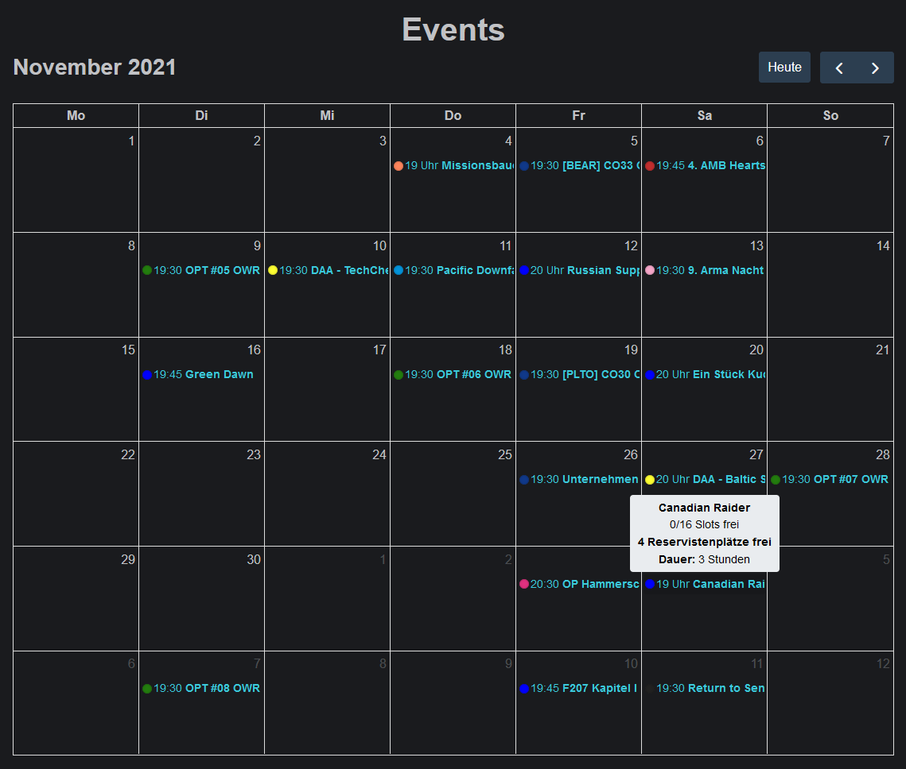

# Event calendar

The focus of planning is based on events. These are planned sessions for which potential attendees are able to sign up.

The event calendar provides a calendar overview of all past and already planned future events. Colour codes allow you to quickly distinguish between different types of events.

Clicking on an event opens the [event-details.md](event-details.md "mention").
