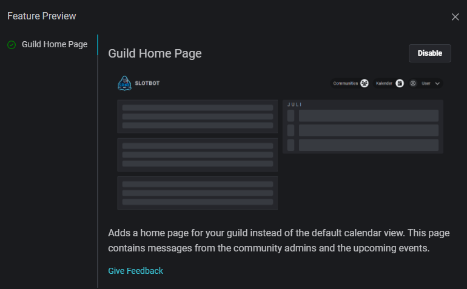

# Update 18.07.2024

<table data-card-size="large" data-view="cards"><thead><tr><th></th><th></th><th data-hidden data-card-target data-type="content-ref"></th></tr></thead><tbody><tr><td><strong>Slotbot-Server</strong></td><td>2.12.0 </td><td><a href="https://github.com/Alf-Melmac/slotbotServer/releases/tag/v2.12.0">https://github.com/Alf-Melmac/slotbotServer/releases/tag/v2.12.0</a></td></tr><tr><td><strong>Slotbot-Frontend</strong></td><td>1.10.0 </td><td><a href="https://github.com/Alf-Melmac/slotbot-frontend/releases/tag/v1.10.0">https://github.com/Alf-Melmac/slotbot-frontend/releases/tag/v1.10.0</a></td></tr></tbody></table>

## ⭐ New Features

* The `/archive`command is back. This has been replaced by the deletion of event channels. Now it only archives the event of the channel and thus prevents interaction or updates, the channel and the event output are retained. _(commit:_ [_a2825b0d_](https://github.com/Alf-Melmac/slotbotServer/commit/a2825b0db067de3a2c01ed504b58e08233712ae4)_)_
*   Feature preview: New start page _(_[_#472_](https://github.com/Alf-Melmac/slotbot-frontend/pull/472)_,_ [_#90_](https://github.com/Alf-Melmac/slotbotServer/pull/90)_)_

    * Logged-in users can enable advance access to the upcoming home page via the feature preview, which can be accessed via the profile picture in the navigation bar after logging in.

    <figure><figcaption></figcaption></figure>

    * The home page provides an overview of recent or upcoming events, and community administrators can create posts to share information.
    * I need your feedback to make the new entry point a good one. How useful is the information on the page? What should be included and what should be left out? Should there be quick access to certain functions? [Let me know what you think!](https://discord.gg/HSkgZNhfNK)
