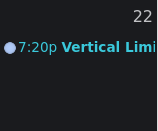
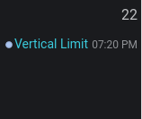

# Update 29.12.2023

<table data-card-size="large" data-view="cards"><thead><tr><th></th><th></th><th data-hidden data-card-target data-type="content-ref"></th></tr></thead><tbody><tr><td><strong>Slotbot-Server</strong></td><td>2.8.0 </td><td><a href="https://github.com/Alf-Melmac/slotbotServer/releases/tag/v2.8.0">https://github.com/Alf-Melmac/slotbotServer/releases/tag/v2.8.0</a></td></tr><tr><td><strong>Slotbot-Frontend</strong></td><td>1.7.0 </td><td><a href="https://github.com/Alf-Melmac/slotbot-frontend/releases/tag/v1.7.0">https://github.com/Alf-Melmac/slotbot-frontend/releases/tag/v1.7.0</a></td></tr></tbody></table>

## ⭐ New Features

* Not a new design, but a much better one
  * The navigation bar at the top leaves more space for the content that matters. Especially on mobile devices. _(commit:_ [_1ded8075_](https://github.com/Alf-Melmac/slotbot-frontend/commit/1ded807556549b7bd4cf9b1eae52b6c56b7511f6)_)_
  * Font sizes adapt dynamically to the screen size. _(commit:_ [_1ded8075_](https://github.com/Alf-Melmac/slotbot-frontend/commit/1ded807556549b7bd4cf9b1eae52b6c56b7511f6)_,_ [_82a28a36_](https://github.com/Alf-Melmac/slotbot-frontend/commit/82a28a36f4ba83b431144c38916284a0cb472f38)_)_
  * Roboto is now really being used all over the place and not just downloaded. _(commit:_ [_1ded8075_](https://github.com/Alf-Melmac/slotbot-frontend/commit/1ded807556549b7bd4cf9b1eae52b6c56b7511f6)_)_
  * Not only does the event title now have more space in the calendar, but it is also much more prominent as the time is now displayed as secondary information. _(commit:_ [_1ded8075_](https://github.com/Alf-Melmac/slotbot-frontend/commit/1ded807556549b7bd4cf9b1eae52b6c56b7511f6)_)_
    *    
  * Today's date will no longer be coloured yellow in the calendar, but the date itself will be highlighted. (commit: [346873db](https://github.com/Alf-Melmac/slotbot-frontend/commit/346873db513c9b613507f161aa63b576531a6209), [edc2e8ba](https://github.com/Alf-Melmac/slotbot-frontend/commit/edc2e8baaab70ad3b0b8d0bd69fb3775321b5620))
    *    
  * Event details and slot list are displayed more clearly on mobile devices, making better use of the space available. _(commit:_ [_53212965_](https://github.com/Alf-Melmac/slotbot-frontend/commit/53212965ec9a3d2c099f880de4e2e1fc3d3d3446)_,_ [_7c020e83_](https://github.com/Alf-Melmac/slotbot-frontend/commit/7c020e835be4c6c55ed60e2c91db9a5d7a2b1936)_)_
* Welcome to the TTT with its own design. _(commit:_ [_91a42e40_](https://github.com/Alf-Melmac/slotbot-frontend/commit/91a42e4022778251bbe96368a9dbe58b7e3841b1)_,_ [_984fdf4a_](https://github.com/Alf-Melmac/slotbot-frontend/commit/984fdf4af2123da37d12b1ff6b3a3955beae867a)_,_ [_edc2e8ba_](https://github.com/Alf-Melmac/slotbot-frontend/commit/edc2e8baaab70ad3b0b8d0bd69fb3775321b5620)_,_ [_3599df2a_](https://github.com/Alf-Melmac/slotbotServer/commit/3599df2ac448eb73b161a1d155c31e6b8aa1c900)_,_ [_8837fc70_](https://github.com/Alf-Melmac/slotbotServer/commit/8837fc70d4f1675f75b2541d90448534e0dec7aa)_,_ [_bbbf4c75_](https://github.com/Alf-Melmac/slotbot-frontend/commit/bbbf4c7508d33f946baa3f85754790bcfece8295)_,_ [_16e70330_](https://github.com/Alf-Melmac/slotbot-frontend/commit/16e70330769533aafeab2f5bcbd104ed5de785cd)_)_
* The last remaining references to the Discord CDN have been replaced. For details see [update-13.10.2023.md](update-13.10.2023.md "mention"). _(commit:_ [_3599df2a_](https://github.com/Alf-Melmac/slotbotServer/commit/3599df2ac448eb73b161a1d155c31e6b8aa1c900)_)_
* In addition to the basic text [formatting.md](../../event-creation/formatting.md "mention") already supported, headings are now also recognised as valid formatting and will be displayed. _(commit:_ [_c06356e7_](https://github.com/Alf-Melmac/slotbotServer/commit/c06356e7adbe436b25a28472ed15b63fe5952e37)_,_ [_b41d6f3b_](https://github.com/Alf-Melmac/slotbotServer/commit/b41d6f3bbbfb1f518e4089131fcf180fb078a538)_)_
* If the bot does not have administrative permissions, the event output will not be cancelled if it does not have permissions to edit messages and cannot remove the pin success message. _(commit:_ [_1f9f5148_](https://github.com/Alf-Melmac/slotbotServer/commit/1f9f5148bb2779f9d6da3fba210ecb2a2c2384df)_)_
* In addition to the standard text channels, all other channel types with chat can now also be used as event and archive channels. These include threads, forum posts and announcement channels. _(commit:_ [_6880608d_](https://github.com/Alf-Melmac/slotbotServer/commit/6880608d53b210eeb9354eea2154ffef1541b619)_)_
* Consistent naming of events rather than missions. _(_[_#407_](https://github.com/Alf-Melmac/slotbot-frontend/pull/407)_) by_ [_@MenomDE_](https://github.com/MenomDE)
* For now, the root page automatically redirects to the calendar. More on this next year. _(commit:_ [_58b6ee39_](https://github.com/Alf-Melmac/slotbot-frontend/commit/58b6ee391d9b6ff35275b09771ecccccdc6ec3b5)_)_

## 🐞 Bug Fixes

* Events between 23:00 and 23:59 are no longer displayed in the calendar for two days. _(commit:_ [_6faa5be2_](https://github.com/Alf-Melmac/slotbot-frontend/commit/6faa5be2f8fcb16fd4ea7dd4be1512ee842adf75)_)_

## 🔨 Technical

* Only in dev mode is the XSRF token sent to other hosts. _(commit:_ [_65da465f_](https://github.com/Alf-Melmac/slotbot-frontend/commit/65da465f4768f0bec618ddd43a4c83ad423bccec)_)_
* The Roboto font is now delivered statically, rather than being loaded from Google's servers. `(Thanks Menom for the hint)` _(commit:_ [_1ded8075_](https://github.com/Alf-Melmac/slotbot-frontend/commit/1ded807556549b7bd4cf9b1eae52b6c56b7511f6)_)_
