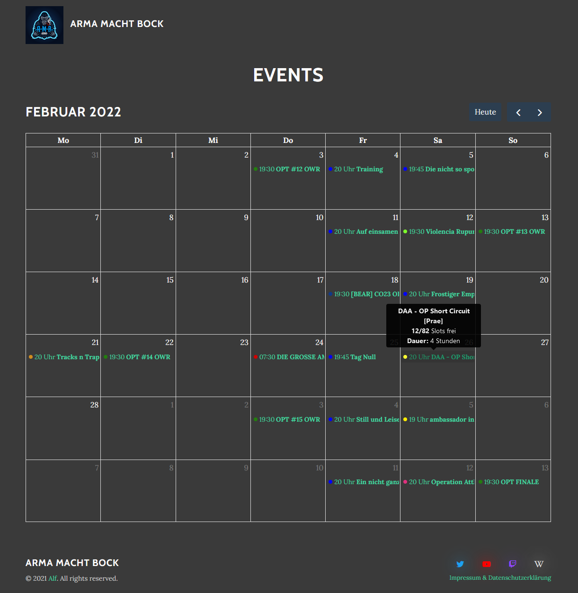
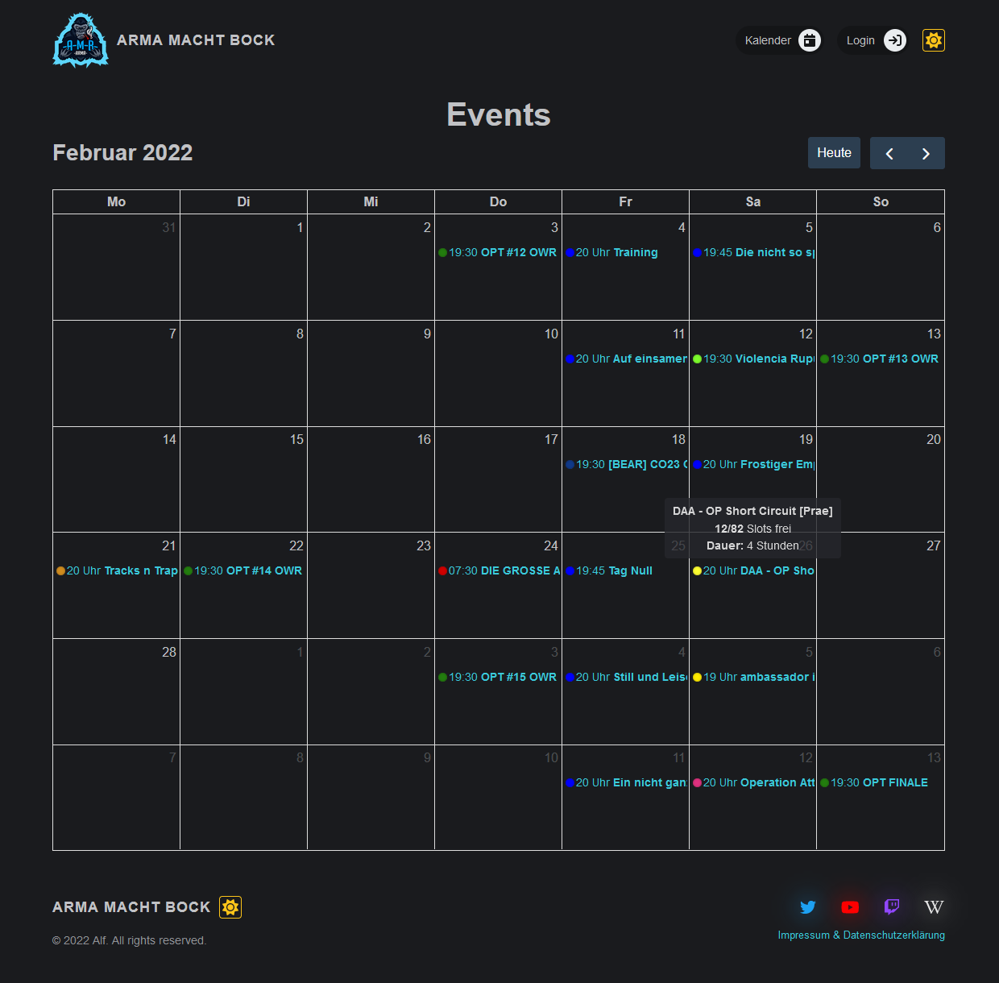
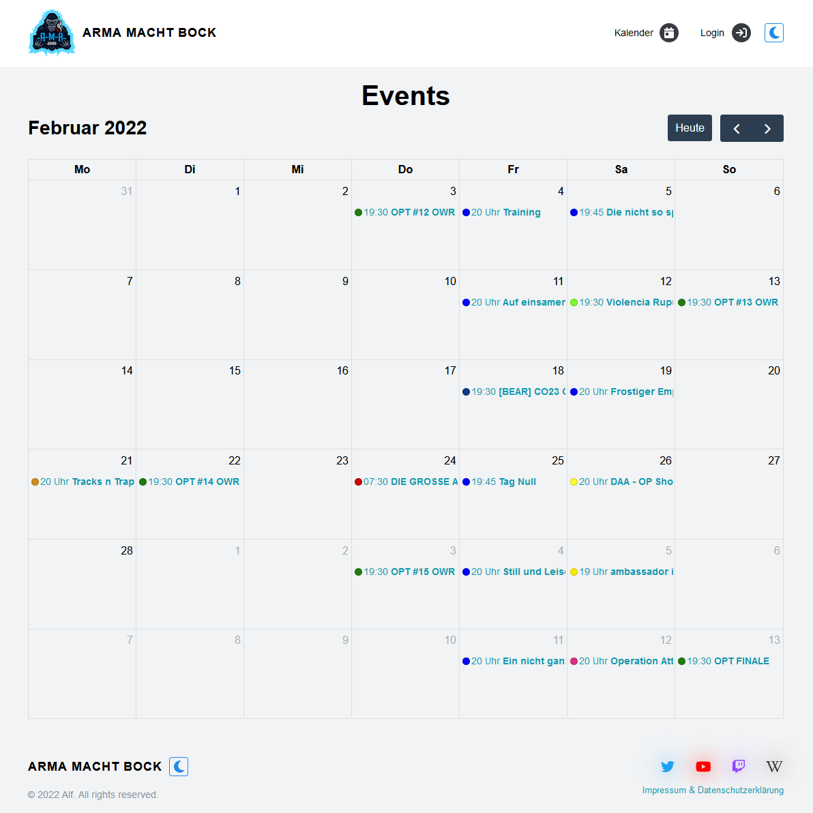
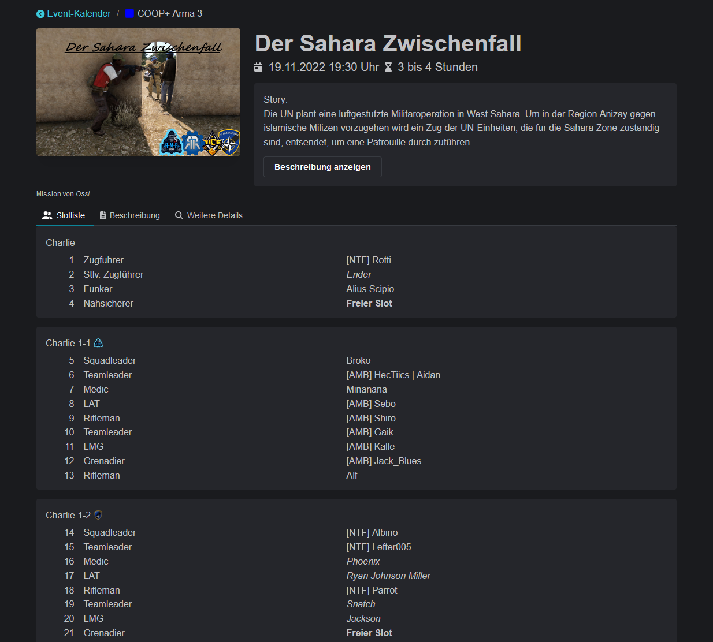
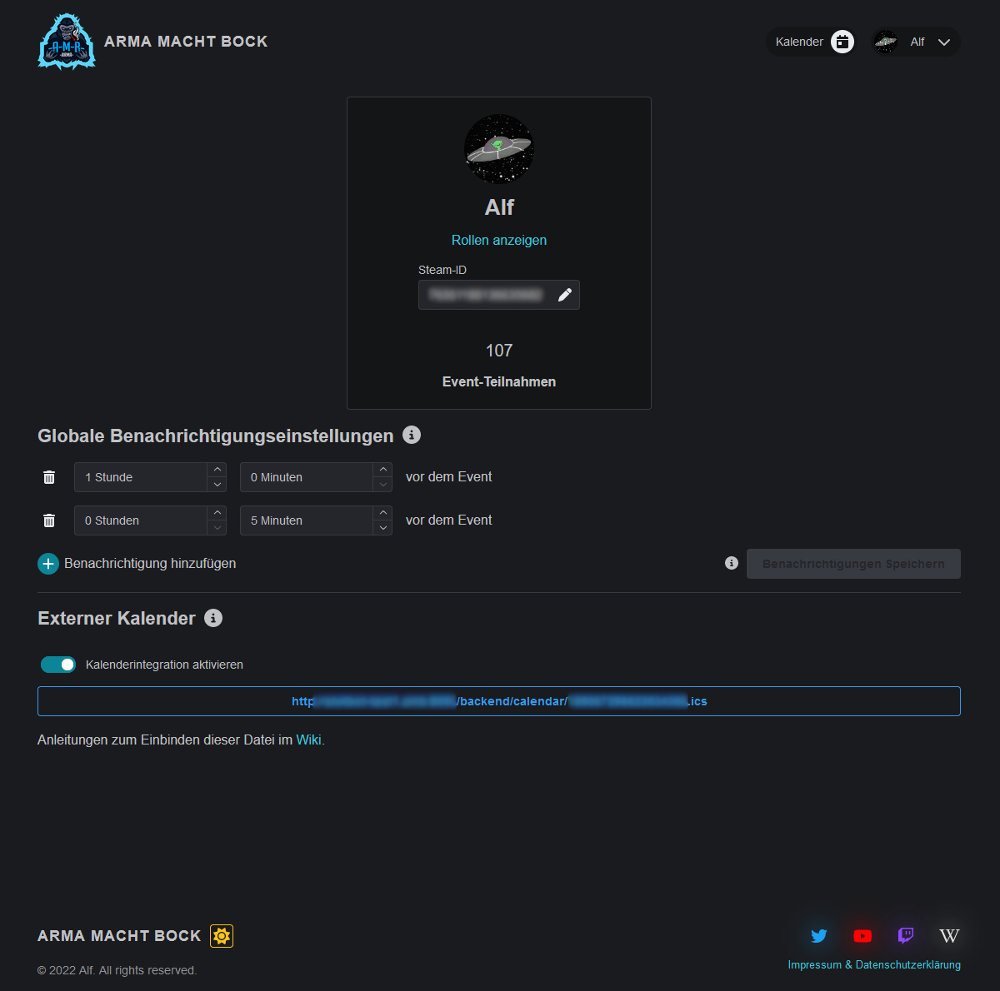

# Update 30.11.2022

## ✨ Newer, better, more beautiful!

The technological conversion has been completed. At the same time, the new interface is now available. Here are a few impressions:

<figure><figcaption>
This is how you know the calendar so far
</figcaption></figure>

 

<figure><figcaption>
In a new look
</figcaption></figure>

 

<figure><figcaption>
or would you prefer it in light?
</figcaption></figure>

<figure><figcaption>
Click me, I'll get bigger
</figcaption></figure>

 

<figure><figcaption>
I see more of the description and can tell the groups apart better!
</figcaption></figure>

<figure><figcaption></figcaption></figure>

 

<figure><figcaption>
Only the information relevant to me with more space for notifications. Otherwise I forget the events :(
</figcaption></figure>

Statistics are great. Therefore I mention here from the backend project with the old frontend the [213 changed files](https://github.com/Alf-Melmac/slotbotServer/compare/b3d841982d4f0a5e8f53c42349521ede447848f4...89ffd5693ded34eac2611cd7bb96c3362d9fb7ef) with **1,876 additions** and **9,496 deletions** in **104 Commits**. And in the new frontend project [160 changed files](https://github.com/Alf-Melmac/slotbot-frontend/compare/4139362f8e435e77b2588800348d0517a4afe735...ac25ba88a8fa835841590dfe2ab524fa9dbcbb8a) with **8,298 additions** and **26,727 deletions** in **313 Commits** after the initial setup.

## ⭐ New Features

* If the user has already logged in once, he or she will not be asked for confirmation again when logging in to Discord, but will be logged in directly. _(commit:_ [_463785aa_](https://github.com/Alf-Melmac/slotbotServer/commit/463785aa457cf80d2408a6fb5f49d59332c2c5fd)_)_
* Reservations are displayed in the Discord slot list. _(commit:_ [_72cc227f_](https://github.com/Alf-Melmac/slotbotServer/commit/72cc227fe30b0d987bb73259556b14909d2c553c)_)_
* The selection of groups for reservations is now sorted alphabetically. _(commit:_ [_4d1bc65a_](https://github.com/Alf-Melmac/slotbotServer/commit/4d1bc65a1e58a817f29f1bd9c5ae95aeadf9481e)_)_
* Login is now possible on every page and also redirects back to this page. In addition, the login status, including the new quick navigation, is visible at all times via the display at the top right.
* The system administrator role no longer needs to be configured via Discord. This eliminates the role on the server. _(commit:_ [_b0bf6c68_](https://github.com/Alf-Melmac/slotbotServer/commit/b0bf6c682bf198a474002f39a57572627e9e68f6)_)_
* Increased safety through better checks
  * Faster and improved permission check. If something not permitted is attempted, you will now notice it more quickly. Don't do it anyway.
  * Requests are only accepted from confirmed URLs and browsers.
* Arma 3 modset autocomplete and map selection has been updated to the [August 2022 modset from AMB](https://wiki.armamachtbock.de/de/Spieler/Mitmachen/Modset). Maps now also remain free text fields. _(commit:_ [_409e7a6c_](https://github.com/Alf-Melmac/slotbotServer/commit/409e7a6c02f05ce38e176669ce962df37441ba42)_)_
* The `mission.sqm` upload is no longer in the beta phase. However, if unexpectedly wrongly generated slots appear, please send Alf the file and the expected result. The upload mechanism is explained in more detail directly during the upload.
* Significant improvements in usability
  * The click on the own profile picture is better visible. There you will now also find a logout.What do the group of people and the eye do in event creation and editing and what status do they actually have? Now it is explained.
  * Fields that are too long or invalid are validated during input before they are saved. This eliminates the question of whether there are still enough characters for all the information.
  * The event date no longer has to be typed in YYYY-MM-DD format.
  * Event details help, for example auto-completion of maps and modsets, is now offered without using all details.
  * When inserting standard details, existing details are no longer overwritten.
  * Inheritances of reservations are displayed in the reservation view of slots.
  * Events in the past can be edited without adjusting the date.
  * The lack of saving details or the slot list when editing an event is now clearly visible.
  * During event processing, it is clear at a glance which fields use which type of storage.
  * Most pages are much easier to use on mobile.
  * Support for assistance systems, in particular Screen Reader, has been greatly expanded.
  * All data is updated live. If the tab with the event details remains in the background, you will see the current data when you come back without reloading.

And much more that would be too detailed to list here.

## 🐞 Bug Fixes

* Under rare circumstances, the slot list could not be output or updated in Discord for large events. _(commit:_ [_0fb501ab_](https://github.com/Alf-Melmac/slotbotServer/commit/0fb501abd7d67431f0126b2cf4aa6571a17c6e04)_)_

## :inbox\_tray: Other details

* Event types can no longer exist with the same name with different colours.
  * Therefore, a new event type cannot be created while editing an event.
* ~~Rearranging details and squads in events is not yet possible via the new interface.~~ -> [update-31.03.2023.md](update-31.03.2023.md "mention")
* In the administration, the fixed status display for the AMB events has been removed. In addition, the slot log is no longer accessible.
* The start page is no longer needed and has been outsourced to a [separate project](https://github.com/AMB-Coding/amb-landingpage).
* All pages have been given a new look and feel. Yes, even the error pages.


The first two features and the bug fixes, along with a security fix, were already installed before and on 31.03.

