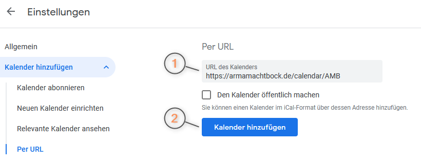
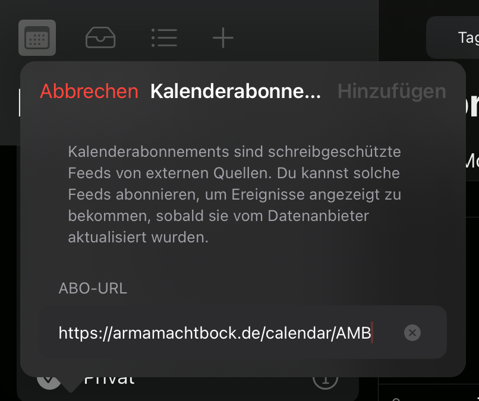
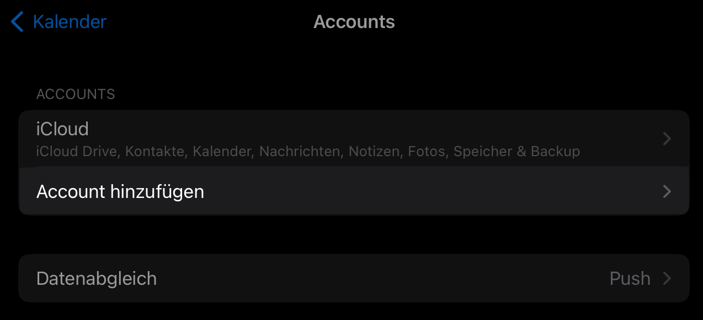
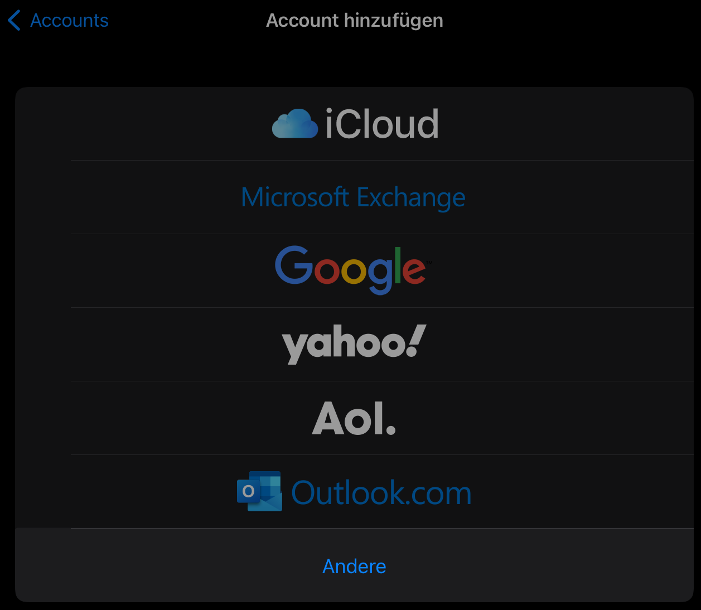
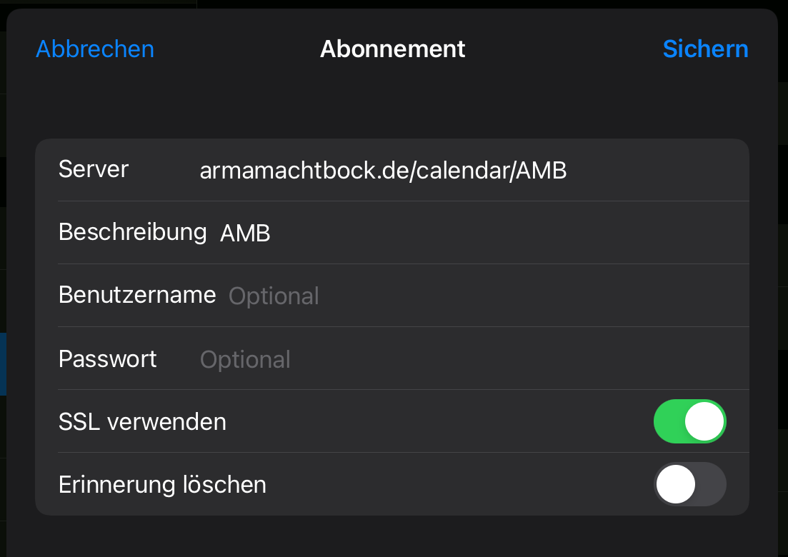

# Calendar sync

Planning the event evenings with the family without losing track? No problem! Just enable the external calendar in [your profile](https://slotbot.de/profile/me) and add it to your own calendar.

This is the standard iCalendar format (recognisable by the .ics extension). This format is supported by the majority of the popular calendar applications. See the page below for step-by-step instructions for Google and Apple calendars.


For selected groups, the entire calendar is also available as an import. This then contains all events that are also visible on the website in the group calendar. _Examples_: [AMB](https://armamachtbock.de/calendar/AMB) and [DAA](https://events.deutsche-arma-allianz.de/calendar/DAA)


### Google Calendar

In the [calendar](https://calendar.google.com/) under "More calendars" add a new calendar per URL.

Insert the URL from the profile or that of the group and click "Add calendar".

That's it! To make sure your calendar is always up to date, you may need to manually enable synchronisation in the [synchronisation settings](https://calendar.google.com/calendar/syncselect).

### Apple

 

If this does not work, as in my picture, you can also configure a calendar in the settings.

  

 

