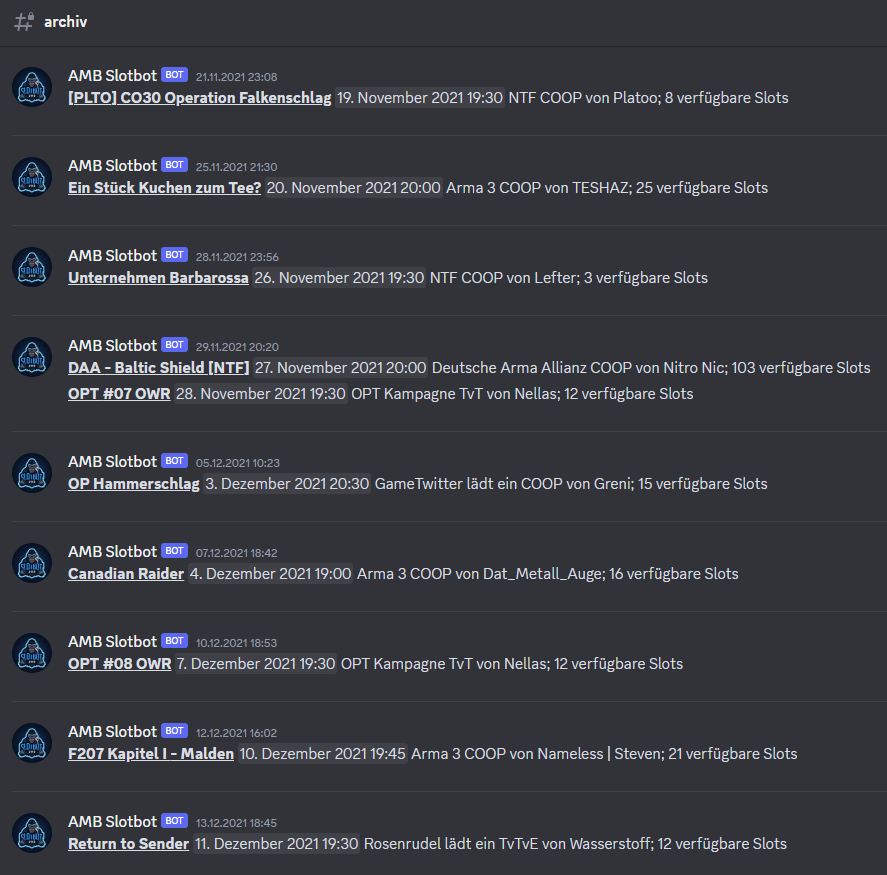
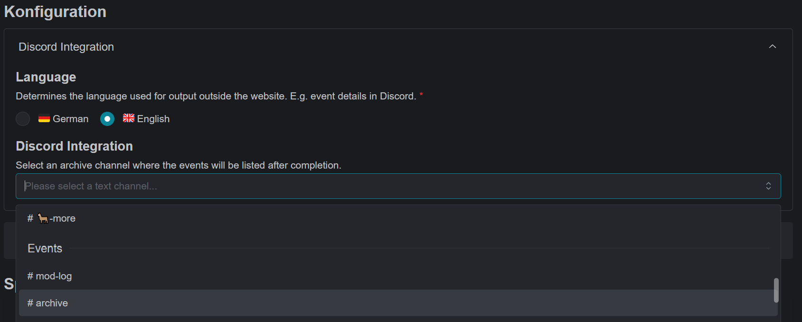

# Archive

It does not always seem to make sense to keep many channels with old events and their details. However, an event overview can be a useful tool for new players, helping them to identify event days and sizes.

The Slotbot offers the possibility to list all past events in one channel.

<figure><figcaption></figcaption></figure>

## Setup

Select an archive channel in the [community configuration](../../community-management/communities-guilds.md).

<figure><figcaption></figcaption></figure>

If an event channel is later deleted, the information is automatically posted to the archive channel.

If the channel and event output are to be retained, the [archive.md](archive.md "mention") command can be used as an alternative. This will also trigger the archive message, but the channel can then be used for new events.

## Rebuild Archive

If the archive should ever be moved to another channel or the configuration is done later, the entire archive can be recreated with the [archiv-neu-aufbauen.md](bot-befehle/archiv-neu-aufbauen.md "mention") command. Depending on the number of past events, this may take some time.
