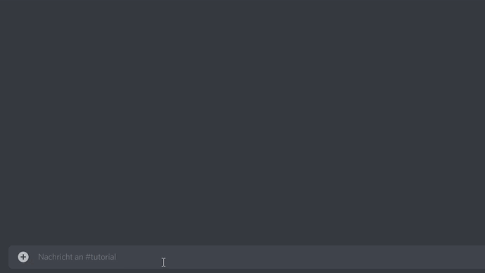

# Add event to channel

## Command

/add\_event\_to\_channel

\-> Event selection

## Process

Adds a previously created event to the current channel and outputs it.

## Answer


Event is output.



* An event is already assigned to this channel.
* No unassigned event found in the future.
* Someone beat you to it. The event is already assigned to {}.

