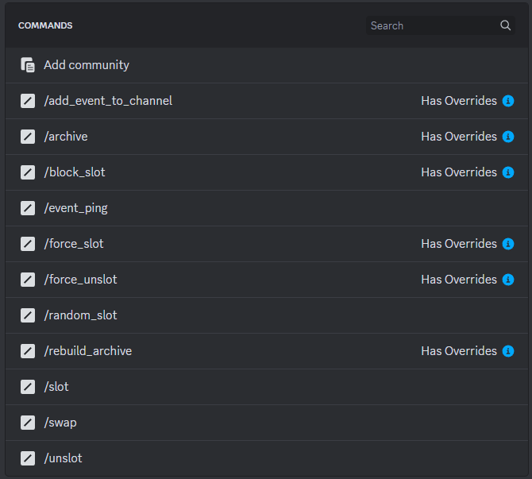

# Recommended configuration

## Command Permissions

For the smoothest possible permissions configuration, it is recommended that the roles created by the bot are given command permissions. Of course, configuring according to other roles or individual persons is also possible here. [Learn more about managing integrations.](https://support.discord.com/hc/en-us/articles/360045093012-Server-Integrations-Page)

<figure><figcaption></figcaption></figure>

<table><thead><tr><th>Command</th><th>Overwrite<select><option value="d9c8a423143a43cd83f335036c944fd5" label="Slotbot_Event_Manage" color="blue"></option><option value="7cbe1a3caed44a18920193d6f08c7ead" label="Slotbot_Admin" color="blue"></option></select></th><th data-type="content-ref">Details</th></tr></thead><tbody><tr><td>Add_Event_To_Channel</td><td>Slotbot_Event_Manage</td><td><a href="bot-befehle/event-hinzufuegen.md">event-hinzufuegen.md</a></td></tr><tr><td>Block_Slot</td><td>Slotbot_Event_Manage</td><td><a href="bot-befehle/slot-blockieren.md">slot-blockieren.md</a></td></tr><tr><td>Force_Slot</td><td>Slotbot_Event_Manage</td><td><a href="bot-befehle/slot-erzwingen.md">slot-erzwingen.md</a></td></tr><tr><td>Force_Unslot</td><td>Slotbot_Event_Manage</td><td><a href="bot-befehle/unslot-erzwingen.md">unslot-erzwingen.md</a></td></tr><tr><td>Rebuild_Archive</td><td>Slotbot_Admin</td><td><a href="bot-befehle/archiv-neu-aufbauen.md">archiv-neu-aufbauen.md</a></td></tr></tbody></table>
