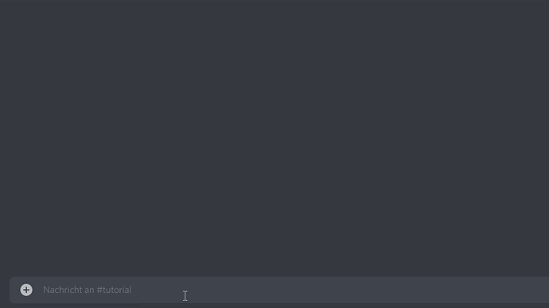

# AddEventToChannel

## Befehl

/addEventToChannel

\-> Eventauswahl

## Aktion

Fügt dem aktuellen Kanal ein bereits erstelltes Event hinzu und gibt es aus.

## Antwort


Event {} dem aktuellen Kanal hinzugefügt.



* Diesem Kanal ist bereits ein Event zugeordnet.
* Kein nicht zugeordnetes Event in der Zukunft gefunden.
* Da war jemand schneller als du. Das Event ist bereits {} zugeordnet.

