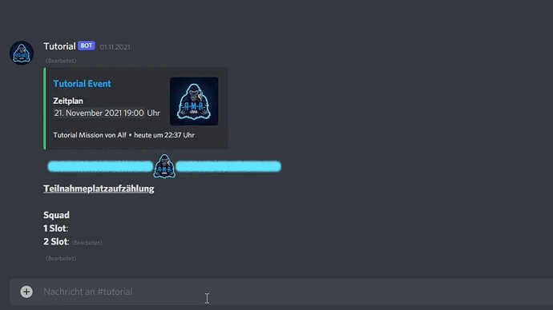

# ForceSlot

## Befehl

/forceSlot `slotnummer` `user`

## Aktion

Trägt die ausgewählt Person auf dem Slot mit der ausgewählten Nummer ein.


Suchst du nach [Text anstelle einer Person eintragen](blockslot.md)? Oder wie du dich [selbst slottest](slot.md)?

