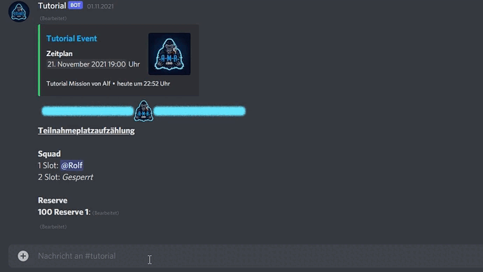

# ForceUnslot

## Befehl

/forceUnslot `slotnummer`

## Aktion

Entfernt die eingetragene Person oder Blockierung von dem Slot mit der angegebenen Nummer.


Suchst du danach, wie durch dich [selbst ausslottest](unslot.md)?

