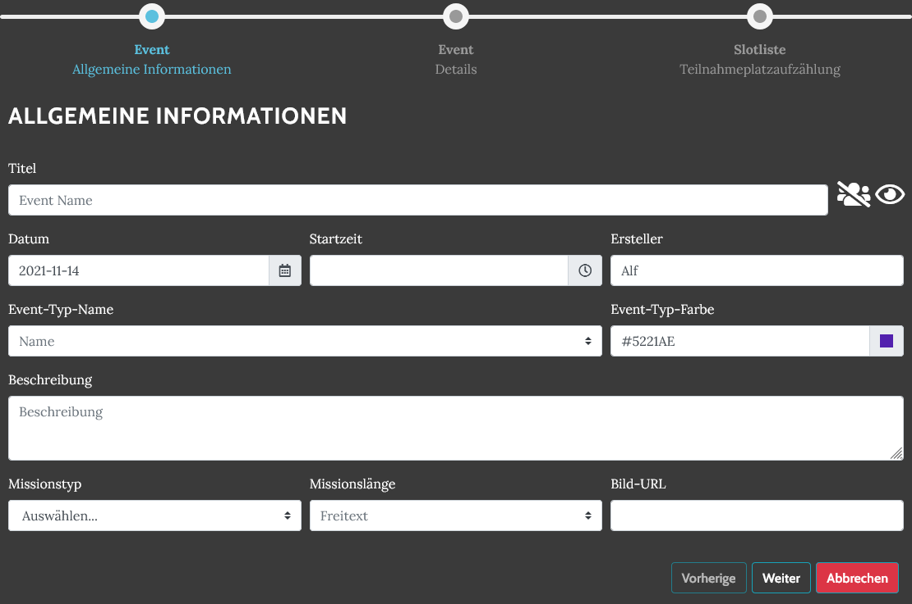
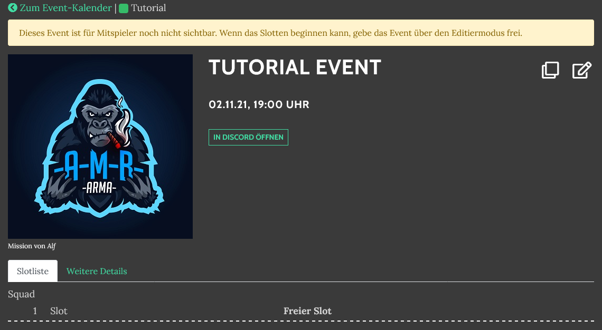
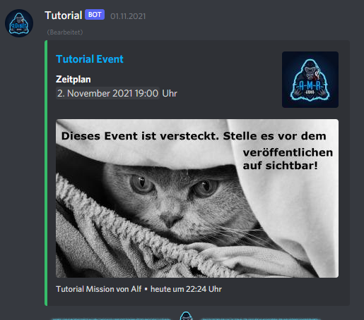
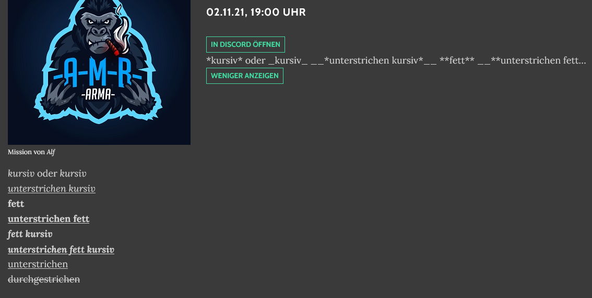
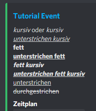
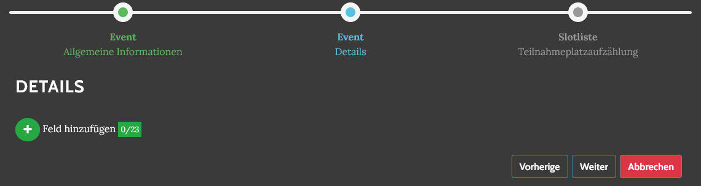
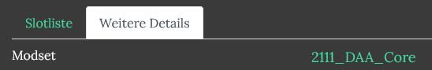
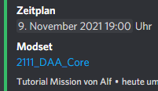
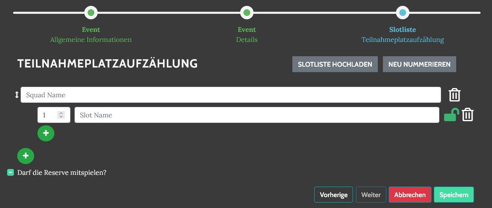
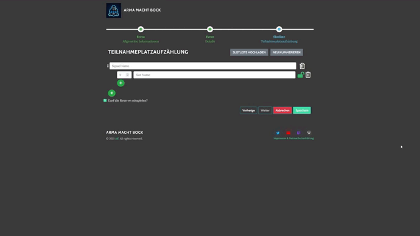

# Eventerstellung

Events können nur über die Website erstellt werden. Nach dem erfolgreichen Login auf das passende Datum im Kalender klicken und der Wizard öffnet sich. Alternativ direkt [/events/new](https://armamachtbock.de/events/new) öffnen.

## Allgemeine Informationen

Über die  Schaltfläche kann die **Teilbarkeit** eines Events aktiviert werden. Wird die Teilbarkeit erlaubt, können andere Gruppen die den Slotbot verwenden, dass Event ihrem Kalender hinzufügen und sich auf Slots eintragen.

Über die  Schaltfläche kann die **Sichtbarkeit** des Events konfiguriert werden. Wird ein Event versteckt, taucht es im Kalender nur für Personen mit der Rolle Slotbot\_Event\_Manage oder höher nach Anmeldung auf.

 

Der **Event-Typ** kategorisiert Events. Durch die ausgewählte Farbe lassen sich Missionsreihen im Kalender und im Discord auf den ersten Blick erkennen.

Innerhalb der **Beschreibung** können die aus Discord bekannten Formatierungen verwendet werden. [Discord Support Artikel](https://support.discord.com/hc/en-us/articles/210298617-Markdown-Text-101-Chat-Formatting-Bold-Italic-Underline-\*\*\*\*)

 

## Details

Im zweiten Schritt des Wizards können 23 Freitextfelder definiert werden.

Für manche Event-Typen gibt es definierte Standard-Felder, die dem Event-Ersteller einen Leitfaden geben können. Siehe dazu [event-standards.md](event-standards.md "mention").

#### Spezielle Details

 Ein Feld mit dem Namen "Modset" kann automatisch verlinkt werden. Dazu muss die passende Download-Datei auf dem Server hochgeladen werden.

## Slotliste

Die Slotliste eines Events bestimmt immer aus Gruppen ("Squads") und Plätzen innerhalb dieser Gruppen ("Slots"). Die Reihenfolge der Gruppen kann frei bestimmt werden. Die Slots werden anhand ihrer Slotnummer aufsteigend sortiert.

Über das  Symbol kann ein Slot während der Erstellung blockiert werden. Dadurch taucht er später als "_Gesperrt_" auf und Teilnehmer können sich nicht auf diesen Platz eintragen. Siehe dazu auch den Befehl [blockslot.md](../bot-befehle/blockslot.md "mention").

#### Arma-Missions-Upload

Es gibt die Möglichkeit, die in Arma 3 erstellte Slotliste hochzuladen, um automatisiert die Slotliste generieren zu lassen.

