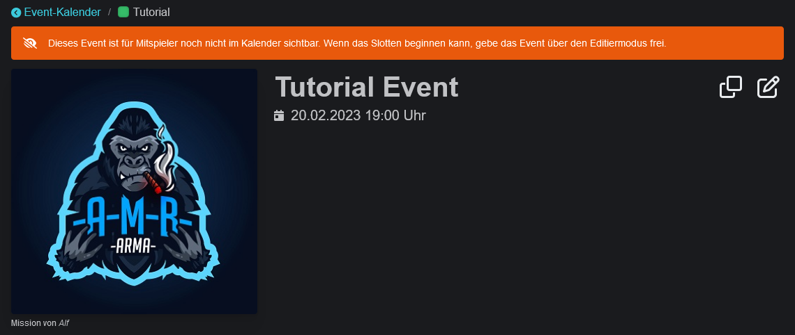

# Eventerstellung

Events können nur über die Website erstellt werden. Nach dem erfolgreichen Login über dem Kalender "Neus Event anlegen" auswählen und die Eingabemaske öffnet sich.

## Allgemeine Informationen

<figure><figcaption></figcaption></figure>

Standarmäßig wird anderen Gruppen, die den Slotbot verwenden, erlaubt sich neue Events in ihren Kalender hinzuzufügen und auf freie Slots einzutragen. Durch deaktivieren der **Teilbarkeit** kann dieses Event nur im eigenen Discord ausgegeben werden. Davon ausgenommen sind durch Reservierungen eingeladene Gruppen.

Durch das **Verstecken** eines Events kann das Event im Kalender nur noch nach Anmeldung von Personen mit der Rolle `Slotbot_Event_Manage` oder höher gesehen werden.

 

Der **Event-Typ** kategorisiert Events. Durch die ausgewählte Farbe lassen sich Missionsreihen im Kalender und im Discord auf den ersten Blick erkennen.

<figure><figcaption>
Event-Typ-Farbe im Kalender
</figcaption></figure>

 

<figure><figcaption>
Event-Typ in den Event-Details
</figcaption></figure>

Innerhalb der **Beschreibung** können die aus Discord bekannten Formatierungen verwendet werden. Die Syntax beschreibt Discord in einem [Support Artikel](https://support.discord.com/hc/de/articles/210298617-Markdown-Text-101-Chat-Formatierung-Fett-Kursiv-Unterstrichen-).

 

## Details

Im zweiten Schritt des Wizards können 23 Freitextfelder definiert werden.

Für manche Event-Typen gibt es definierte Standard-Felder, die dem Event-Ersteller einen Leitfaden geben können. Siehe dazu [event-standards.md](event-standards.md "mention").

#### Spezielle Details

 Ein Feld mit dem Namen "Modset" kann automatisch verlinkt werden. Dazu muss die passende Download-Datei auf dem Server hochgeladen werden.

 

<figure><figcaption>
Verlinkung in Discord
</figcaption></figure>

## Slotliste

Die Slotliste eines Events besteht immer aus Gruppen ("Squads") und Plätzen innerhalb dieser Gruppen ("Slots"). ~~Die Reihenfolge der Gruppen kann frei bestimmt werden.~~ Die Slots werden anhand ihrer Slotnummer aufsteigend sortiert.

Über das Drei-Punkte-Menü hinter jeder Zeile können zusätzliche Einstellungen vorgenommen. Ganze Squads oder einzelne Slots können mit Hilfe einer Reservierung für bestimmte Gruppen reserviert werden. Darauf ist nur Community-Mitgliedern der ausgewählten Gruppen möglich sich auf diesen Plätzen einzutragen.\
Slots können außerdem blockiert werden. Dies verhindert Anmeldungen für diesen Platz. Angezeigt wird dies in der Slotliste entweder als "_Gesperrt_" oder den gewählten Ersatztext. Siehe dazu auch den Befehl [slot-blockieren.md](../bot-befehle/slot-blockieren.md "mention").

#### Arma-Missions-Upload

Es gibt die Möglichkeit, die in Arma 3 erstellte Slotliste hochzuladen, um automatisiert die Slotliste generieren zu lassen.

Dazu die Mission im Arma 3 Editor speichern und darauf achten, dass "Szenariodatei binarisieren" nicht aktiviert ist. Danach befindet sich die `mission.sqm`, die im Event-Wizard hochgeladen werden soll, im Missionordner. Dieser befindet sich unter `%USERPROFILE%\Documents\Arma 3` -> `missions` oder `mpmissions`.
