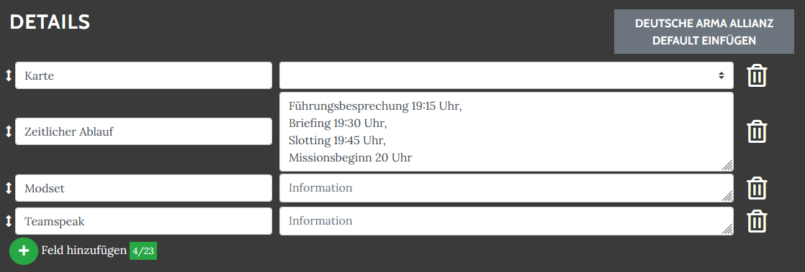

# Event Standards

Über die Schaltfläche "X Default einfügen" können für die unten gezeigten Event-Typen Event-Details-Vorschläge gemacht werden. Dadurch wird der Ersteller eines Events an die wichtigen Infos erinnert, die er den Teilnehmern mitteilen sollte.

## Arma 3

## Deutsche Arma Allianz

## OPT Kampagne

