# Eventkalender

Der Eventkalender bietet einen kalendarische Übersicht über alle vergangenen und bereits geplanten zukünftigen Events. Durch Farbcodes können Eventtypen schnell auseinander gehalten werden.

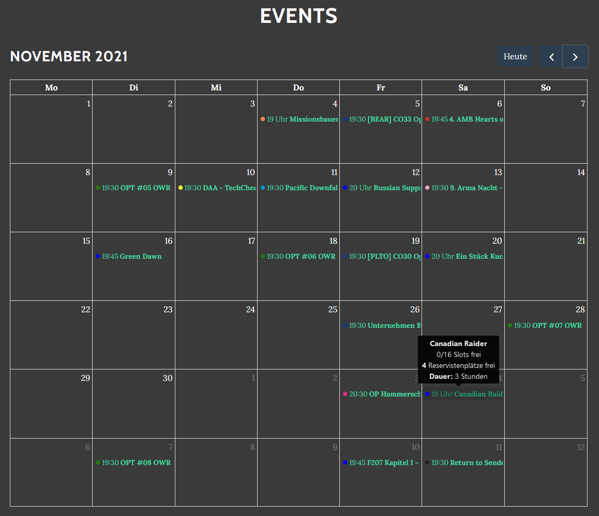

## Kalender-Synchronisation

Die Eventabende mit der Familie planen und nicht den Überblick verlieren? Kein Problem! Einfach [im Profil](https://armamachtbock.de/profile/me) den externen Kalender aktivieren und im eigenen Kalender einfügen.

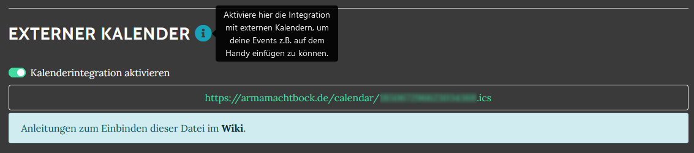

Es handelt sich hierbei um das standardisierte iCalendar Format (an der .ics Endung zu erkennen). Die meisten gängen Kalender unterstützen dieses Format. Für eine Schritt für Schritt Anleitung für den Google und Apple Kalender siehe unten.


Für ausgewählte Gruppen gibt es auch den gesamten Kalender als Import. Dieser enthält dann alle Events, die auch auf der Website im Gruppen-Kalender sichtbar sind. _Beispiele:_ [AMB](https://armamachtbock.de/calendar/AMB) und [DAA](https://events.deutsche-arma-allianz.de/calendar/DAA)


### Google Kalender

Im [Kalender](https://calendar.google.com) unter "Weitere Kalender" einen neuen Kalender Per URL hinzufügen.

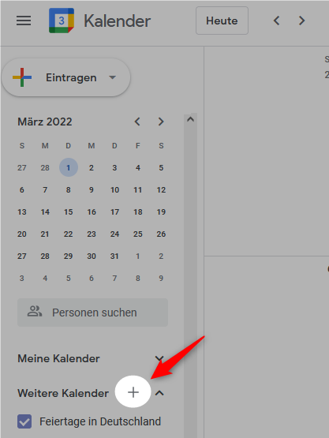

Die URL aus dem Profil oder die der Gruppe einfügen und "Kalender hinzufügen" klicken.

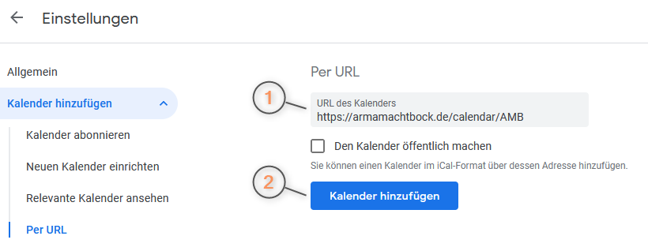

Das war schon! Damit der Kalender stets aktualisiert wird muss die Synchronisation teils manuell in den [Synchronisierungseinstellungen](https://calendar.google.com/calendar/syncselect) aktiviert werden.

### Apple

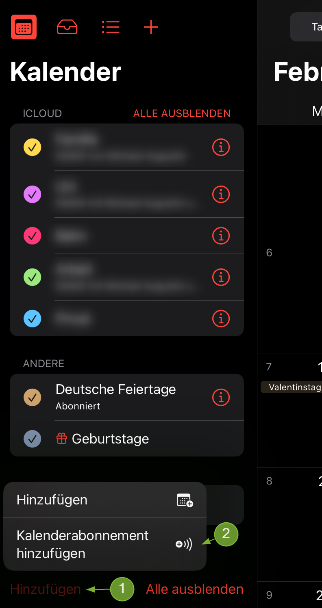 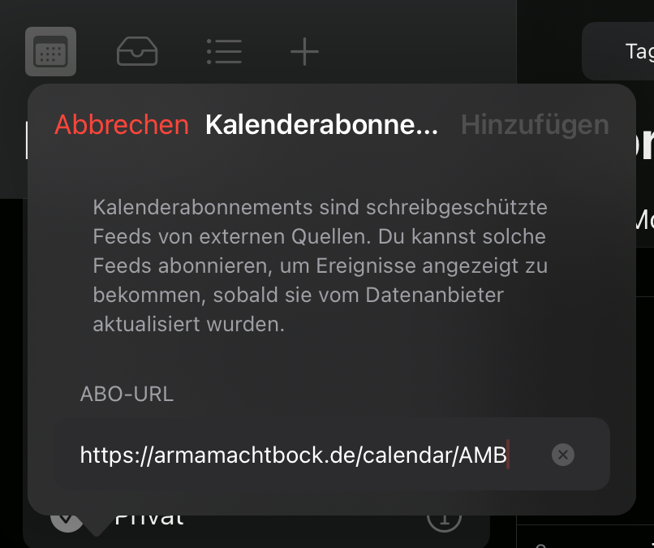

Falls dies, wie bei mir im Bild, nicht funktioniert, kann ein Kalender auch über die Einstellungen konfiguriert werden.

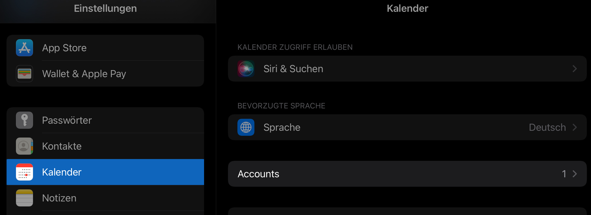

  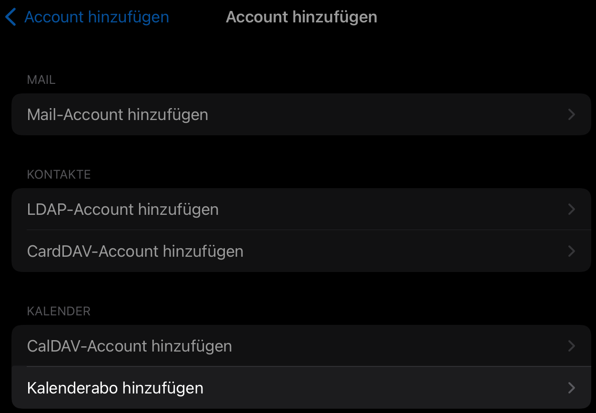

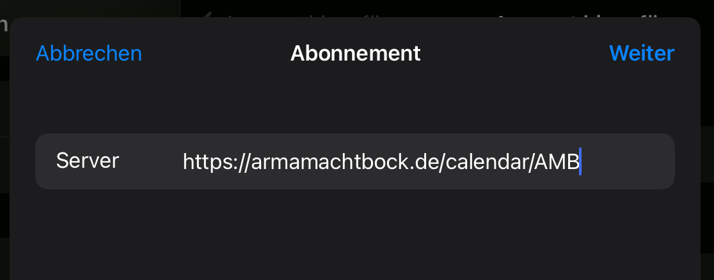 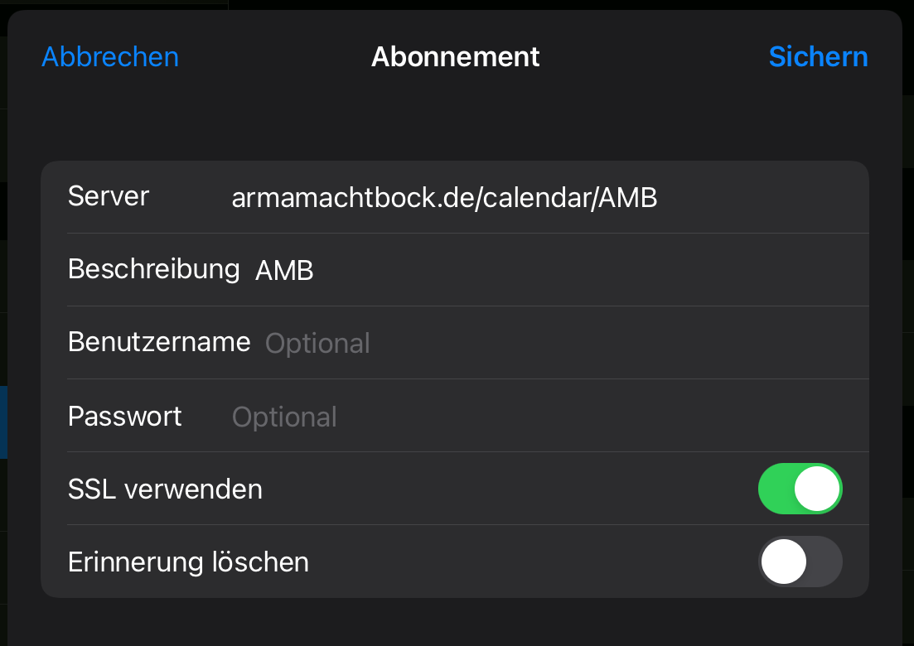

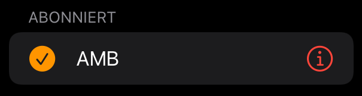
