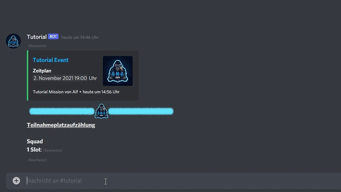
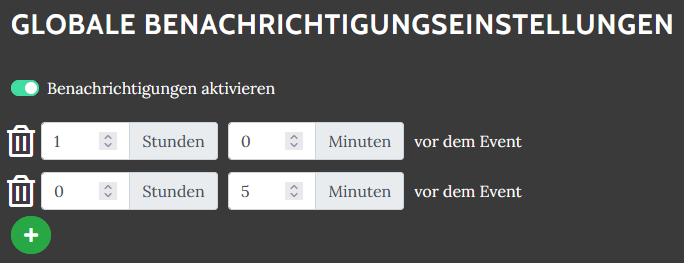

# Slotbot

Dein Tool zur Planung des nächsten Spieleabends! Planung oder Vorbereitung über die Website, API oder die umfassende Discord Integration.

## Discord Integration

_Details unter _[bot-befehle](bot-befehle/ "mention")__

### Anmeldungsverwaltung

Nur eine begrenzte Anzahl spezifischer Rollen verfügbar? Kein Problem! Teilnehmer melden sich im voraus für spezifische Rollen an.

### Benachrichtigungen 

Kein verpasstes Event mehr. Eingetragene Teilnehmer eines Events können sich so oft und so früh wie sie selbst möchten für ein Event über Discord benachrichtigen lassen. Für jeden [hier](https://armamachtbock.de/profile/me) selbst konfigurierbar.

#### Integriert in den eigenen Kalender 

iCalender (.ics Datei) Import in beliebigen Kalender.

## Eventerstellung

Einfacher Event-Wizard, der alle Details für die Teilnehmer übersichtlich abfragt.

 Immer das Gleiche, aber doch nicht die selben Infos? Wenn eine Event-Kopie zu viel ist, gibt es die Möglichkeit für Event-Typen Standards festzulegen. Damit vergisst kein Event-Ersteller mehr die wichtigen Details.

**Speziell für Arma 3**: Mission.sqm Upload. Slotliste aus dem Missionsbau auf der Website importieren und kein zweites mal die Slotliste anlegen.

_Details unter _[eventerstellung](eventerstellung/ "mention")__

## Ein Login für Alles

Login auf der Website über den Discord Account. Berechigungsprüfungen über Discord Rollen, die nur für Management-Berechtigungen benötigt werden.

## Eigener Eventkalender

 Getrennter Kalender, eigenes Design und Branding, Einladen anderer Gruppen über einen Klick und automatisch verlinkte Modsets. Speziell zugeschnitten und unter der eigenen Domain zur Verfügung gestellt.

_Beispiele_: [AMB](https://armamachtbock.de/events) und [DAA](https://events.deutsche-arma-allianz.de/events)

Mit \* markierte Features müssen eigens entwickelt werden. Bei Interesse Alf für Details kontaktieren.

> Bilder zur Verfügung gestellt von Discord oder in Discord aufgenommen.
