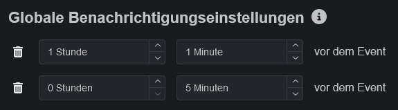
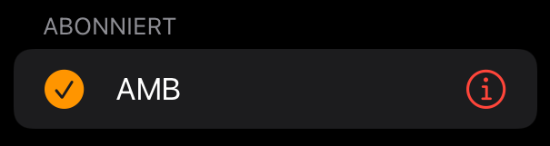

# Slotbot

Dein Tool zur Planung des nächsten Spieleabends! Planung oder Vorbereitung über die Website, API oder die umfassende Discord Integration.

## Discord Integration

<figure><figcaption></figcaption></figure>

Teilnehmer können auf einer Plattform bleiben und erhalten alle Informationen und Interaktionen gebündelt.

_Details unter_ [bot-befehle](bot-befehle/ "mention")

### Ein Login für Alles

Login auch auf der Website über den eigenen Discord-Account. Berechigungskonfiguration über Discord-Rollen, die nur für Management-Rollen benötigt werden.

## Anmeldungsverwaltung

Nur eine begrenzte Anzahl spezifischer Plätze verfügbar? Kein Problem! Teilnehmer melden sich im Voraus für geplante Plätze an.

Sollten alle Plätze belegt sein wird automatisch, in Form einer Reserve, Platz für Nachrücker geschaffen.

## Benachrichtigungen

Kein verpasster Termin mehr. Eingetragene Teilnehmer eines Events können sich so oft und so früh wie sie möchten für ein Event über Discord benachrichtigen lassen.

<figure><figcaption></figcaption></figure>

## Integriert in den eigenen Kalender

iCalender (.ics Datei) Import in beliebigen Kalender. Damit sind die Events jederzeit in der eigenen Hosentasche, auch ohne Internet.

## Eventerstellung

Einfach schnelles Anlegen mit dem Event-Wizard. Alle wichtigen Informatione für die Teilnehmer im richtigen Format.

<figure><figcaption></figcaption></figure>

 Immer das Gleiche, aber doch nicht die selben Infos? Wenn eine Event-Kopie zu ausführlich ist, können Standards für Event-Typen festgelegt werden. Damit vergisst kein Event-Ersteller mehr die wirklich wichtigen Dinge.

### Speziell für Arma 3

`mission.sqm` Upload. Slotliste aus dem Missionsbau auf der Website importieren und kein zweites mal die Slotliste anlegen.

_Details unter_ [eventerstellung](eventerstellung/ "mention")

## Eigener Eventkalender

 Getrennter Kalender, eigenes Design und Branding, Einladen anderer Gruppen über einen Klick und automatisch verlinkte Modsets. Speziell zugeschnitten und unter der eigenen Domain zur Verfügung gestellt.

_Beispiele_: [AMB](https://armamachtbock.de/events) und [DAA](https://events.deutsche-arma-allianz.de/events)

> Mit \* markierte Features nur auf Anfrage. Bei Interesse Alf für Details kontaktieren.
